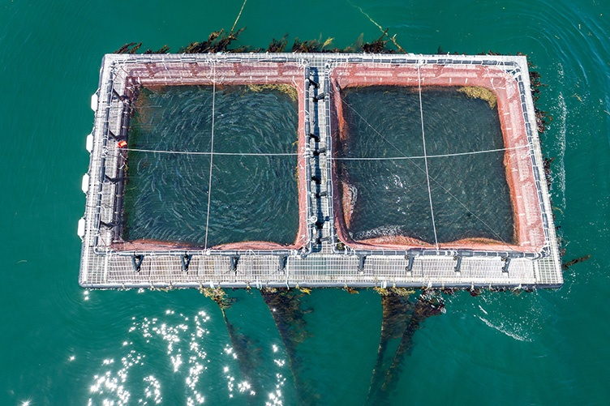

# IMTA Analytics



## Data Science & AI Tools for Sustainable Integrated Multi-Trophic Aquaculture

A research and development platform for predictive yield modeling, intelligent decision support systems, and precision farming technologies for IMTA operations. Developed in partnership with UNH Aquafort.

---

## Why IMTA?

> "This project demonstrated a viable method of culturing steelhead trout, blue mussels, and sugar kelp in sea cages without negatively impacting the surrounding environment... This methodology could be adopted by fishers to create a diversified income from three cultured crops."  
> — Chambers et al., 2024 (UNH Aquafort)

Integrated Multi-Trophic Aquaculture represents a fundamental shift toward ecosystem-based food production:

- **Environmental**: Convert waste into harvestable biomass, reduce eutrophication (16.4 kg nitrogen reduction per cycle at UNH Aquafort)
- **Economic**: Diversify revenue streams, capture premium prices (24-174% revenue increase vs. monoculture in published studies)
- **Social**: Align aquaculture with sustainability values, support coastal fishing communities

**The Challenge**: Realizing IMTA's potential at commercial scale requires intelligent systems to manage multi-species complexity, predict outcomes across variable environmental conditions, and optimize operations. This project aims to accelerate IMTA adoption through data-driven optimization and AI-powered decision support.

---

## Mission

Bridge the gap between cutting-edge aquaculture research and practical operations by developing AI-powered tools that:

- **Predict** biomass yields based on environmental factors (in development)
- **Monitor** water quality parameters using satellite and IoT sensor fusion (planned)
- **Optimize** multi-species stocking densities and harvest timing (planned)
- **Assist** operators with intelligent decision support and troubleshooting (planned)
- **Quantify & extend validation** of IMTA's environmental benefits through data analysis
- **Advance understanding** of multi-species interactions (future scope)

---

## Core Projects

### 1. Predictive Yield Modeling (In Development)

Machine learning models to forecast harvest weights for multi-species IMTA systems, with **finfish yield forecasting as primary focus** (identified by UNH CSSS team as critical operational capability):

- **Environmental Parameters**: Temperature, dissolved oxygen, chlorophyll-a, salinity
- **Operational Factors**: Stocking density, feeding regimes, biomass loading
- **Finfish Growth Priority**: Dynamic Energy Budget (DEB) models for steelhead trout/Atlantic salmon with temperature-growth coupling and FCR optimization (partnership approach leveraging CSSS domain expertise)
- **Extractive Species**: Seaweed and shellfish models (60-70% of biomass) to follow finfish implementation

For comprehensive feature definitions, see [Predictive Features Catalog](docs/living/predictive-features-catalog.md).

**Target Performance**: R² > 0.90, MAPE < 10%[^2]

**Planned Technologies**:

- Random Forest, XGBoost, LSTM neural networks
- Physics-informed neural networks (hybrid mechanistic-ML approach)
- Sentinel-2/3 satellite imagery, public & commercial datasets, and in-situ sensor integration (public & commercial datasets)

[^2]: Aspirational target based on published intensive aquaculture systems (R² = 0.98, Xu et al., 2025). Not yet validated for New England IMTA conditions.

### 2. IMTA Operator Co-Pilot (AI Assistant) (Planned)

Conversational AI system to provide decision support, training, and troubleshooting - **identified by UNH CSSS team alongside finfish yield forecasting as critical operational capability**:

- **Natural Language Interface**: Ask questions like "Why is my oxygen dropping?" or "Should I harvest early?"
- **Proactive Alerts**: Predictive anomaly detection (24-48 hour advance warnings)
- **Scenario Simulation**: "What if I increase stocking by 20%?" → model-based forecasting
- **Knowledge Base**: Integrated access to 60+ research papers (majority Open Access[^3]), SOPs, and regulatory guidelines
- **Explainable Recommendations**: SHAP analysis, causal inference, physics-informed constraints with literature citations

[^3]: Open Access status verification in progress via DOI resolution

**Planned Technologies**:

- Conversational AI grounded in IMTA-specific knowledge base leveraging commercial LLMs (Anthropic, OpenAI, Google) and open models aligned with UNH-Ai2 partnership
- Knowledge graphs (Google Enterprise Knowledge Graph or open-source GraphDB) for structured aquaculture domain knowledge
- Function calling to query databases, run models, access sensor APIs

### 3. Multi-Source Data Integration Pipeline (In Development)

Automated data collection, harmonization, and quality control from:

- **Satellite Remote Sensing**: Sentinel-2 MSI (10m), Sentinel-3 OLCI/SLSTR (300m-1km)
- **Biogeochemical Models**: CMEMS numerical forecasts
- **IoT Sensor Networks**: DO, temperature, pH, salinity (Campbell Scientific dataloggers, YSI EXO2)
- **Farm Records**: Growth measurements, feeding logs, harvest data

**Current Implementation**:

- TOA5 data loader for Campbell Scientific dataloggers
- Data quality control for marine sensor data
- Managed cloud services evaluation (GCP BigQuery, Vertex AI) for scalability and cost optimization
- PostgreSQL/TimescaleDB architecture (planned for edge deployment scenarios with limited connectivity)

---

## Research Focus & Opportunities

**Current Phase:** Literature review (60+ papers analyzed) and exploratory data analysis of UNH Aquafort buoy station data (2023-2024). Current work includes:

- **Sensor Data Pipeline**: TOA5 format parsing, quality control for Campbell Scientific dataloggers and YSI EXO2 water quality sensors
- **Baseline Environmental Characterization**: Temperature, dissolved oxygen, salinity, chlorophyll-a, turbidity patterns at offshore site
- **Data Quality Methods**: Behavioral heuristics for detecting sensor errors and cascading failures in marine IoT systems

Focus areas below represent planned research directions informed by literature and collaboration priorities to be determined with CSSS team. **For comprehensive platform capabilities and research-validated features, see [Platform Opportunity Document](docs/analysis/20251112-imta-analytics-platform-opportunity.md).**

### Environmental Monitoring & Prediction (Planned)

- **Dissolved Oxygen Forecasting**: Target R² > 0.90 (benchmark: published R² = 0.98 - Xu et al., 2025)
- **Hypoxia Early Warning**: Detection of critical events (DO thresholds species-dependent, require CSSS validation for New England conditions)
- **Temperature-DO Interaction Modeling**: Capturing synergistic effects

### Growth & Yield Optimization (Planned)

- **Finfish Growth Models**: Primary revenue driver - DEB models for steelhead trout and Atlantic salmon with temperature-growth coupling, FCR optimization, and harvest timing predictions (Mediterranean finfish models[^4] require New England adaptation)
- **Extractive Species Models**: Seaweed and shellfish (60-70% of IMTA biomass) require new ML forecasting capabilities for kelp seasonality and mussel bioremediation
- **Feed Conversion Efficiency**: Dynamic FCR prediction based on environmental conditions (temperature, DO, stocking density)
- **Harvest Window Optimization**: Align species cycles, maximize market price capture

[^4]: Stavrakidis-Zachou et al. (2021), Chatziantoniou et al. (2023) demonstrate DEB applications for European sea bass and meagre

### Species Interaction & Nutrient Cycling (Planned)

Key collaboration area - CSSS to lead research and product specification, catalyzed partner to focus on implementation and operations.

- **Bioremediation Quantification**: N/P removal by extractive species
- **Trophic Transfer Modeling**: Fish effluent → mussel/kelp uptake pathways
- **Carrying Capacity Assessment**: Optimize ratios based on site characteristics

### Economic Analysis & Market Intelligence (Planned)

Economic measurement & prediction capabilities provide foundation; opportunity to partner with an Economics PhD or Post-Doc to expand domain expertise and significantly accelerate timeline.

- **Net Present Value (NPV) Modeling**: IMTA vs. monoculture profitability
- **Risk-Adjusted Returns**: Product diversification benefits
- **Price Premium Analysis**: Consumer willingness-to-pay for sustainable products

### Research Gaps & Collaboration Opportunities

**AI/ML Development Needs:**

1. **Finfish Yield Forecasting**: Primary revenue driver (DEB models validated for Mediterranean species; need New England adaptation for steelhead/salmon with temperature-growth coupling and FCR optimization)
2. **Extractive Species Yield Models**: Seaweed and shellfish represent 60-70% of IMTA biomass but lack validated ML forecasting (critical gap for kelp seasonality and mussel bioremediation quantification)
3. **Integrated Multi-Species Models**: Current models treat species independently; need coupled nutrient transfer dynamics
4. **Causal Inference**: Move beyond correlation → enable "what-if" scenario testing with confidence bounds
5. **Edge AI Deployment**: Reduce prediction latency for real-time decision support (current cloud models: 12-48 hour lag)
6. **Explainable AI**: Integrate SHAP/LIME interpretability methods for operator trust and adoption

**Domain Science Needs (CSSS Collaboration):**

1. **Species Interaction Coefficients**: Parameterize DEB models for multi-trophic nutrient transfer (fish → mussel/kelp)
2. **Validated Environmental Thresholds**: Species-specific DO, temperature, pH tolerance ranges for New England conditions (steelhead, mussels, kelp)
3. **Biofouling Impact Quantification**: Effects on sensor accuracy, cage dynamics, and extractive species growth
4. **Seasonal Growth Variability**: Multi-year baseline data for kelp and mussel growth under New England environmental forcing

**Community & Data Infrastructure:**

1. **IMTA Data Commons**: Establish open data repository for reproducibility and model validation across sites
    - **Vision**: Create network effects through shared datasets, benchmarking, and collaborative model development
    - **Model**: Tiered data marketplace with freemium access (public baseline data + premium commercial insights)
    - **Impact**: Accelerate research, reduce barriers to entry for new IMTA operations, enable meta-analyses

See full analysis in [`refs/Literature Review - Data Science & AI Applications.md`](refs/Literature%20Review%20-%20Data%20Science%20%26%20AI%20Applications%20in%20Sustainable%20Aquaculture%20Systems.md)

---

## Repository Structure

The project follows standard Python package structure with `imta_analytics/` as the installable package, `notebooks/` for exploratory analysis, `data/` for datasets (not tracked in git), `refs/` for literature (60+ papers and technical manuals), and `docs/` for planning and technical documentation. See [PACKAGE.md](PACKAGE.md) for detailed structure and development guidelines.

---

## Tech Stack

Python-based data science and ML platform leveraging industry-standard tools for geospatial analysis, time-series modeling, and AI/NLP capabilities. Cloud-first architecture (GCP) with consideration for edge deployment scenarios.

**Infrastructure Provider**: Long Horizon Initiative provides cloud infrastructure and API access as catalyzed partner. See [Infrastructure Architecture](docs/living/infrastructure-architecture.md) for detailed technology selections, cost estimates, and evaluation criteria.

---

## Getting Started

### For UNH CSSS Collaborators

**Data Access**: Sensor data from the UNH Aquafort buoy station is shared via email or institutional file sharing. Contact the project team for access credentials. Data files are not tracked in the git repository.

**Repository Access**: Clone the repository to explore analysis notebooks and documentation:

```bash
git clone https://github.com/lhzn-io/imta-analytics.git
cd imta-analytics
```

**Exploratory Analysis**: See [notebooks/01_initial_data_exploration.ipynb](notebooks/01_initial_data_exploration.ipynb) for working examples of TOA5 data loading and quality control methods.

### For Developers

**Prerequisites**: Python 3.10+, Conda (recommended)

**Installation**:

```bash
conda env create -f environment.yml
conda activate imta-analytics
pip install -e .
```

See [docs/living/infrastructure-architecture.md](docs/living/infrastructure-architecture.md) for detailed infrastructure requirements and [PACKAGE.md](PACKAGE.md) for development guidelines.

---

## Literature Benchmarks & UNH Aquafort Validation

This section highlights published research results that demonstrate the potential of AI/ML for IMTA systems, alongside validation data from our UNH Aquafort partnership. Our goal is to replicate these methods and validate findings for New England conditions.

### UNH Aquafort Partnership (Chambers et al. 2024)

**Demonstrated at commercial scale in offshore New England waters:**

- **16.4 kg net nitrogen reduction** per production cycle - quantified bioremediation benefit
- **Multi-species production**: 416 kg steelhead trout, 3,072 kg mussels, 638 kg kelp harvested
- **Feed efficiency**: FCR = 1.24 for steelhead trout (within optimal 1.03-1.65 range)
- **Feasibility validation**: Successful operation of integrated multi-trophic system in exposed offshore environment
- **Data collaboration**: Partnership provides sensor data, operational records, and domain expertise for model development
- **Operational priorities**: Finfish yield forecasting and AI-assisted decision support identified as critical capabilities

This partnership serves as the foundation for validating predictive models developed from published literature.

### Dissolved Oxygen Prediction (Published Benchmarks)

**State-of-the-art performance from intensive aquaculture systems:**

- **R² = 0.98** on validation set - Xu et al. (2025), intensive pond aquaculture, China
- **MAE = 0.034 mg/L** - precision represents 10x improvement over earlier methods (Chatziantoniou 2022)
- Hybrid CNN-SA-BiSRU architecture using 10-minute IoT sensor data (3,500 measurements)

**Validation goal**: Replicate methodology for New England offshore IMTA conditions using UNH Aquafort sensor data. Performance targets may differ due to environmental variability and species composition.

### Growth Modeling (Published Benchmarks)

**Published performance for aquaculture species:**

- **RMSE = 6.92%** for finfish growth prediction using Dynamic Energy Budget models - Stavrakidis-Zachou et al. (2019)
- **Kelp seasonal growth**: 0.77 cm/day (winter) → 3.52 cm/day (spring) - Venolia et al. (2020)
- **DEB models**: Validated for Mediterranean finfish species (European sea bass, gilthead sea bream) with temperature-growth coupling
- **FCR achievement**: UNH Aquafort steelhead trout FCR = 1.24 (within optimal 1.03-1.65 range) - Chambers et al. (2024)

**Validation goal**: Develop species-specific models for New England IMTA species (steelhead trout, mussels, kelp) using UNH Aquafort growth measurements. Finfish yield forecasting identified by UNH CSSS team as critical capability alongside AI-assisted decision support.

### Economic Performance (Published Literature)

**IMTA profitability analyses from global case studies:**

- **Revenue increase**: 24-174% vs. monoculture systems - Knowler et al. (2020) meta-analysis
- **Benefit-cost ratio**: 1.1-1.7 in suitable sites
- **Price premiums**: 10-36% for eco-certified IMTA products (consumer willingness-to-pay studies)

**Validation goal**: Economic modeling for New England market conditions, incorporating species-specific costs and regional market prices.

---

## Documentation

- **[Platform Opportunity & Research Translation](docs/analysis/20251112-imta-analytics-platform-opportunity.md)**: Comprehensive platform capabilities, research-validated features, validation framework, and partnership model
- **[Predictive Features Catalog](docs/living/predictive-features-catalog.md)**: Comprehensive catalog of derived parameters and engineered features for predictive modeling
- **[Infrastructure Architecture](docs/living/infrastructure-architecture.md)**: Technology selections, cost estimates, and evaluation criteria
- **[Data Sources](docs/living/data-sources.md)**: Satellite, sensor, and model data access methods and specifications
- **[Data Format Analysis](docs/analysis/20251104-data-format-analysis.md)**: TOA5 format documentation and sensor data handling
- **Setup Guide** (forthcoming): Detailed installation instructions
- **Model Cards** (forthcoming): Performance metrics, limitations, ethical considerations
- **API Reference** (forthcoming): REST endpoints for model serving
- **Contributing Guidelines** (forthcoming): Development workflow, code standards

---

## Contact & Collaboration

### Team

- **Daniel Fry** - Long Horizon Initiative - Catalyzed Partner[^1]
- **David Fredriksson** - [UNH CSSS Director](https://marine.unh.edu/person/david-fredriksson)
- **Michael Chambers** - [UNH CSSS Research Associate Professor](https://marine.unh.edu/person/michael-chambers)
- **Longhuan Zhu** - [UNH CEPS Ocean Engineering Research Scientist](https://ceps.unh.edu/person/longhuan-zhu)

[^1]: [NSF TTP](https://www.nsf.gov/funding/opportunities/nsf-ttp-national-science-foundation-translation-practice/nsf25-540/solicitation) (National Science Foundation Translation to Practice) - potential

### Strategic Partnership Model

This platform's success depends on **intentional, deeply integrated research partnerships** that combine domain expertise with AI capabilities. The current collaboration with UNH CSSS (Fredriksson, Chambers, Zhu) demonstrates this model:

**Current Partnership Priorities**:

- **Product Vision**: User stories and interaction design for IMTA Operator Co-Pilot AI assistant
- **Domain Knowledge**: Species-specific thresholds, DEB model parameters, environmental tolerance ranges
- **Data Integration**: Multi-site validation datasets, growth measurements, operational context
- **Field Validation**: Testing predictive models in real operating conditions
- **Documentation**: Best practices for IMTA monitoring, quality control protocols, interpretation guides

**Philosophy**: Research collaboration focuses on translating domain expertise into intelligent systems—documentation and product specification often precedes code development.

Future strategic partnerships will be carefully selected to expand validation sites, species coverage, and environmental gradients while maintaining deep technical integration.

### Project Resources

- **Issues**: [GitHub Issues](https://github.com/lhzn-io/imta-analytics/issues)
- **Discussions**: [GitHub Discussions](https://github.com/lhzn-io/imta-analytics/discussions)

---

## Inspiration

IMTA's elegance lies in turning pollution into production—waste nitrogen from finfish becomes nutrition for seaweed and shellfish. This foundational insight, articulated by Chopin over two decades ago, remains the organizing principle for sustainable marine aquaculture:

> "The solution to nitrification is not dilution but conversion."  
> — Chopin et al., 2001
