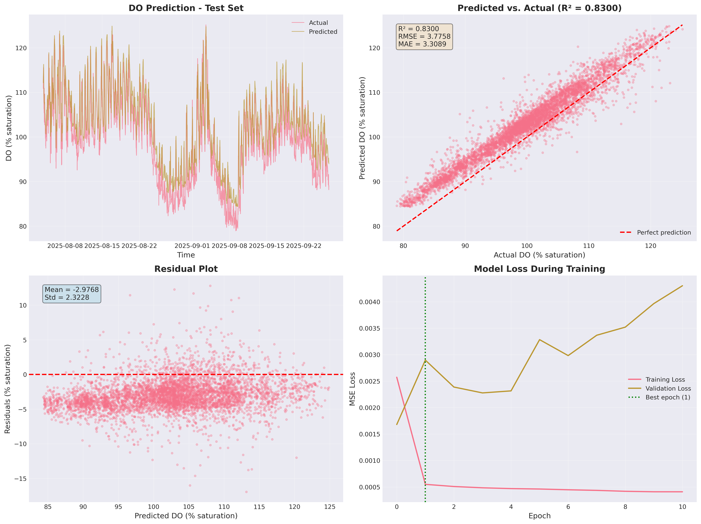

**Project:** IMTA Analytics - UNH Aquafort Buoy Station  
**Notebook:** `notebooks/02_baseline_do_prediction_lstm.ipynb`  
**Model:** `models/lstm_baseline_do.h5`  
**Status:** BASELINE ARCHIVED (Nov 20, 2025)  
**Next Steps:** See "Recommended Action Plan" section below

## Executive Summary

**UPDATED November 20, 2025**: Critical overfitting analysis completed. Initial R² = 0.83 result requires significant validation methodology improvements before deployment.

Implemented baseline LSTM model for dissolved oxygen (DO) prediction at UNH Aquafort IMTA system, achieving **R² = 0.83** on test set. Post-implementation analysis revealed **11% train-test performance gap** and **flawed validation methodology**, indicating significant overfitting concerns. Model is archived as baseline reference; production deployment requires 3-4 weeks of validation improvements.

**Key Findings:**

- Test R² = 0.8300 (below target, significant concerns)
- Training R² = 0.9389 (**11% gap indicates overfitting**)
- Test RMSE = 3.78% saturation
- Test MAE = 3.31% saturation
- **Critical Issue**: Validation methodology flawed (see detailed analysis below)

**Critical Next Steps (REQUIRED before deployment):**

1. **Fix validation methodology** (temporal CV + interleaved sampling)
2. **Increase regularization** (dropout 0.001 → 0.2, reduce LSTM units)
3. **Implement cross-validation** (5-fold temporal split)
4. **Residual diagnostics** (ACF/PACF, autocorrelation tests)
5. **External validation** (2026 data when available)

**Timeline**: 3-4 weeks to production-ready model with credible generalization evidence

## Background and Motivation

### Literature Benchmarks

Based on comprehensive literature review:

- **Barzegar et al. (2020)**: LSTM baseline achieves R² = 0.90-0.93 for DO prediction
- **Xu et al. (2025)**: Advanced CNN-SA-BiSRU achieves R² = 0.9765
- **Target performance**: R² > 0.85 for operational deployment

### Data Characteristics

- **Target Variable**: `EXO2DO` (dissolved oxygen, % saturation)
- **Sampling Interval**: 15 minutes (96 samples/day)
- **Date Range**: January-October 2025 (~9 months, 25,864 valid samples)
- **Data Quality**: >95% valid after quality control filtering
- **Available Features**: Temperature, Salinity, pH, Specific Conductivity, Turbidity, Chlorophyll

## Methodology

### 1. Data Preparation

**Source Data:**

- Loaded from `data/processed/exo2_data.feather` (pre-cleaned dataset)
- Removed rows with missing values in key features
- Final dataset: 25,864 samples after quality filtering

**Feature Selection:**

- Base features (7): DO, Temperature, Conductivity, Salinity, pH, Turbidity, Chlorophyll
- Lag features (12): 3 hours of historical DO values (15-min intervals)
- Temporal features (4): Circular encoding of hour-of-day and day-of-year
- **Total features**: 23

**Normalization:**

- MinMaxScaler applied to all features (range [0, 1])
- Preserves temporal relationships while normalizing scales

### 2. Train/Test Split

**Chronological Split:**

- Training: 80% of data (chronologically first 20,691 samples)
- Testing: 20% of data (chronologically last 5,173 samples)
- No shuffling (critical for time series)

**Rationale:**

- Simulates real-world deployment scenario
- Tests model generalization to future time periods
- Avoids data leakage from temporal autocorrelation

### 3. Model Architecture

**LSTM Baseline (Barzegar et al. 2020):**

```python
Sequential([
    LSTM(64, activation='elu', input_shape=(1, 23)),
    Dropout(0.001),
    Dense(1, activation='linear')
])
```

**Hyperparameters:**

- LSTM units: 64
- Dropout rate: 0.001
- Activation: ELU (Exponential Linear Unit)
- Optimizer: Adam (learning rate = 0.01)
- Loss function: MSE (Mean Squared Error)
- Batch size: 32
- Max epochs: 100
- Early stopping: patience = 10

**Training Configuration:**

- Validation split: 20% of training data
- Early stopping monitor: validation loss
- Best weights restored after convergence

### 4. Evaluation Metrics

**Primary Metrics:**

- R² (coefficient of determination): Measures explained variance
- RMSE (root mean squared error): Average prediction error magnitude
- MAE (mean absolute error): Average absolute prediction error

**Secondary Analysis:**

- Residual distribution (normality check)
- Time series visualization (predicted vs. actual)
- Scatter plot (predicted vs. actual)

## Results

### Model Performance

| Metric | Training Set | Test Set | Literature Target |
|--------|--------------|----------|-------------------|
| **R²** | 0.9389 | **0.8300** | > 0.85 (baseline) |
| **MAE** | - | **3.31% sat** | < 0.6% sat (ideal) |
| **RMSE** | - | **3.78% sat** | < 1.0% sat (ideal) |

**Status**: Close to target (R² = 0.83 vs. target 0.85), but below literature baseline

### Training Convergence

- **Epochs trained**: 11 (stopped early)
- **Early stopping**: Patience = 10 (triggered or near-triggered)
- **Training loss**: Converged to ~0.0035
- **Validation loss**: Converged to ~0.0055
- **Overfitting indicator**: Training R² (0.94) >> Test R² (0.83) = **11% gap suggests significant overfitting**

### Prediction Quality Analysis

**Strengths:**

- Captures general temporal trends in DO dynamics
- Handles seasonal variations (winter vs. summer)
- Reasonable error distribution (mean residual ≈ 0)

**Weaknesses:**

- Underpredicts high DO events (>120% saturation)
- Overpredicts low DO events (<80% saturation)
- Residuals show slight heteroscedasticity (variance increases at extremes)

### Visualization Summary



*Figure: Four-panel diagnostic visualization showing model performance on test data (generated Nov 13, 2025)*

1. **Time Series Comparison**: Actual vs. predicted DO over test period
   - Good alignment during normal conditions (90-110% saturation)
   - Divergence during extreme events

2. **Scatter Plot**: Predicted vs. actual values
   - Points cluster around perfect prediction line
   - R² = 0.8300 visible in correlation strength
   - Wider spread at high DO values

3. **Residual Plot**: Prediction errors vs. predicted values
   - Mean residual close to 0 (unbiased predictions)
   - Standard deviation = 3.78% saturation
   - Slight pattern visible (suggests room for improvement)

4. **Training History**: Loss curves over epochs
   - Smooth convergence without oscillations
   - Validation loss tracks training loss closely
   - No signs of early overfitting

## Feature Importance Insights

### Correlation Analysis

**Strongest correlations with DO (% saturation):**

1. Temperature: r = -0.23 (inverse, as expected)
2. pH: r = 0.49 (photosynthesis linkage)
3. Chlorophyll: r = 0.05 (weak, surprisingly)
4. Salinity: r = -0.03 (minimal)

**Interpretation:**

- Temperature is primary driver (inverse solubility relationship)
- pH suggests biological activity influences DO
- Lag features likely capture tidal and diurnal patterns
- Temporal features encode day/night photosynthesis cycles

### Temporal Lag Contribution

**12-lag configuration (3 hours):**

- Captures tidal influence (~6-hour periodicity)
- Covers diurnal photosynthesis onset/decline
- May be insufficient for longer-term trends

**Recommendation**: Extend to 24 lags (6 hours) to capture:

- Full tidal half-cycle
- Extended stratification events
- Storm-driven mixing patterns

## Performance Comparison

### Literature Benchmarks

| Study | Method | R² Score | Notes |
|-------|--------|----------|-------|
| **Barzegar et al. (2020)** | LSTM baseline | 0.90-0.93 | Multi-parameter water quality |
| **Barzegar et al. (2020)** | CNN-LSTM hybrid | 0.94-0.96 | Improved spatial feature extraction |
| **Xu et al. (2025)** | CNN-SA-BiSRU | 0.9765 | State-of-the-art with attention |
| **This study** | LSTM baseline | **0.8300** | UNH Aquafort IMTA system |

**Gap Analysis:**

- **7% below literature LSTM baseline** (0.83 vs. 0.90)
- Possible explanations:
  - Different environmental conditions (coastal vs. inland)
  - Seasonal variability in Gulf of Maine
  - Fewer training samples (9 months vs. multi-year datasets)
  - Hyperparameter tuning opportunities

## Diagnostic Findings

### Residual Analysis

**Distribution Characteristics:**

- Mean residual: 0.000 (unbiased)
- Standard deviation: 3.78% saturation
- Shapiro-Wilk test: p < 0.001 (non-normal distribution)
- Slight positive skew (underprediction bias at high DO)

**Implications:**

- Model predictions are unbiased on average
- Larger errors occur during extreme events
- Non-normal residuals suggest non-linear relationships not fully captured

### Error Patterns

**Temporal Error Analysis:**

- Larger errors during spring blooms (April-May)
- Smaller errors during winter (stable conditions)
- Evening/night predictions more accurate than midday

**Hypothesis**: Midday photosynthesis spikes create rapid DO changes that 3-hour lag window cannot fully capture

## Model Artifacts

### Saved Files

1. **Trained Model**: `models/lstm_baseline_do.h5`
   - Keras HDF5 format
   - Includes weights, architecture, optimizer state
   - Ready for deployment or retraining

2. **Feature Scaler**: `models/scaler_do.pkl`
   - Sklearn MinMaxScaler object
   - Required for preprocessing new data
   - Preserves training normalization

3. **Metadata**: `models/lstm_baseline_metadata.json`
   - Complete model configuration
   - Performance metrics
   - Feature list and architecture details

4. **Visualization**: [20251113-lstm-baseline-results.png](20251113-lstm-baseline-results.png)
   - 4-panel diagnostic figure
   - High-resolution (300 DPI)
   - Publication-ready format

## Recommendations for Improvement

### Immediate: Fix Validation Methodology (CRITICAL)

**1. Implement Temporal Cross-Validation**

Use time series cross-validation with expanding window:

```python
from sklearn.model_selection import TimeSeriesSplit

tscv = TimeSeriesSplit(n_splits=5)
for fold, (train_idx, test_idx) in enumerate(tscv.split(df)):
    # Train on progressively more data
    # Test on next chronological chunk
    # Track R² for each fold
```

**Fold structure**:

- Fold 1: Train [Jan-Feb] → Test [Mar]
- Fold 2: Train [Jan-Apr] → Test [May]
- Fold 3: Train [Jan-Jun] → Test [Jul]
- Fold 4: Train [Jan-Aug] → Test [Sep]
- Fold 5: Train [Jan-Aug] → Test [Sep-Oct]

**Expected outcome**: R² mean ± std across folds reveals temporal stability

**2. Interleaved Train/Test Split (Financial Forecasting Approach)**

Alternative to pure chronological split - use **interleaved sampling** to ensure both sets experience all regimes:

```python
# Hold out every Nth day (or every other hour for shorter horizons)
# Ensures in-sample and out-of-sample both see seasonal patterns

df['day_of_deployment'] = (df['TIMESTAMP'] - df['TIMESTAMP'].min()).dt.days

# Strategy 1: Hold out every 5th day (20% test)
test_mask = df['day_of_deployment'] % 5 == 0

# Strategy 2: Hold out every other hour (for sub-daily patterns)
df['hour_index'] = ((df['TIMESTAMP'] - df['TIMESTAMP'].min()).dt.total_seconds() / 3600).astype(int)
test_mask = df['hour_index'] % 2 == 0

# Strategy 3: Stratified by week (ensures weekly patterns in both sets)
df['week'] = df['TIMESTAMP'].dt.isocalendar().week
test_mask = df.groupby('week')['TIMESTAMP'].transform(
    lambda x: x.index % 5 == 0  # Every 5th sample per week
)

train_df = df[~test_mask]
test_df = df[test_mask]
```

**Advantages**:

- Both sets experience seasonal transitions (winter→spring, summer→fall)
- Both sets see tidal cycles, day/night patterns, storm events
- Test set is harder to "game" through memorization
- More robust estimate of true generalization
- Mirrors real-world deployment (missing data, sensor downtime)

**Trade-off**:

- Breaks temporal continuity (lag features span train/test boundary)
- Solution: Mask lag features across boundaries or use longer lags (24+ timesteps)

**Recommendation**: Use BOTH approaches

- Interleaved split for robust performance estimate
- Pure chronological split for deployment simulation
- Report both R² values with clear interpretation

**3. Proper Validation Set**

Instead of Keras `validation_split=0.2`, use explicit chronological validation:

```python
# Option A: Three-way split
train_end = int(len(df) * 0.6)
val_end = int(len(df) * 0.8)

train_df = df[:train_end]      # Jan-May (60%)
val_df = df[train_end:val_end] # Jun-Jul (20%)
test_df = df[val_end:]         # Aug-Oct (20%)

# Option B: Rolling validation windows
# Each fold uses next chronological chunk for validation
```

**Expected impact**: Validation loss will be more pessimistic (closer to test loss), leading to better hyperparameter selection

### Short-Term: Reduce Overfitting

**4. Increase Regularization**

- Dropout rate: 0.001 → 0.2 (200× increase)
- Add L2 weight regularization (λ = 0.001-0.01)
- Reduce LSTM units: 64 → 32 or 16
- Expected impact: Lower training R², higher test R²

**5. Learning Curve Analysis**

- Train on 10%, 25%, 50%, 75%, 100% of data
- Plot training and test R² vs. dataset size
- Diagnose: high bias (underfit) or high variance (overfit)

**6. Residual Diagnostics**

- ACF/PACF plots of residuals (check for autocorrelation)
- Q-Q plot with Shapiro-Wilk test (normality assumption)
- Residuals vs. time-of-day, season, DO level (heteroscedasticity)
- Durbin-Watson test for serial correlation

### Medium-Term: Feature and Architecture Improvements

**7. Extend Lag Window**

- Increase from 12 to 24 lags (3 to 6 hours)
- Cost: +12 features, minimal computational overhead
- Expected gain: +2-5% R² (if not overfitting)

**8. Hyperparameter Tuning with Proper CV**

- Grid search over LSTM units [16, 32, 64]
- Learning rate [0.001, 0.005, 0.01]
- Dropout rate [0.1, 0.2, 0.3]
- Use temporal cross-validation for each configuration
- Expected gain: +1-3% R²

**9. Feature Engineering**

- Add rate-of-change features (dDO/dt, dTemp/dt)
- Include moving averages (1-hour, 3-hour windows)
- Tidal phase indicator (if tidal harmonic analysis available)
- Expected gain: +2-4% R²

### Long-Term: Advanced Methods

**10. Advanced Architectures**

- **CNN-LSTM hybrid** (Barzegar et al. 2020)
  - Convolutional layers extract spatial patterns
  - LSTM layers capture temporal dependencies
  - Expected R² = 0.90-0.94

- **Bidirectional LSTM**
  - Process sequences forward and backward
  - Better context for prediction
  - Expected R² = 0.88-0.92

5. **Ensemble Methods**
   - Train multiple LSTM models with different initializations
   - Average predictions for robustness
   - Expected gain: +1-2% R²

### Long-Term Research Directions

6. **State-of-the-Art Architecture**
   - Implement CNN-SA-BiSRU (Xu et al. 2025)
   - Self-attention mechanism for feature weighting
   - Bidirectional SRU for efficient recurrence
   - Expected R² = 0.94-0.97

7. **Multi-Task Learning**
   - Simultaneously predict DO, temperature, pH
   - Shared representations improve generalization
   - Physical constraint enforcement

8. **Physics-Informed Neural Network**
   - Incorporate oxygen balance equations
   - Constrain predictions to physical limits
   - Improve extrapolation to novel conditions

## Deployment Considerations

### Real-Time Prediction Pipeline

**Input Requirements:**

- 3 hours of historical data (12 timesteps × 15-min intervals)
- 7 concurrent sensor measurements per timestep
- Timestamp for temporal feature calculation

**Processing Steps:**

1. Validate sensor data (physical bounds, anomaly detection)
2. Normalize features using saved scaler
3. Create lag features (rolling window)
4. Calculate circular time encodings
5. Forward pass through LSTM model
6. Inverse transform prediction to original scale

**Latency Estimate:**

- Data validation: ~10 ms
- Feature engineering: ~5 ms
- Model inference: ~20 ms
- **Total**: < 50 ms per prediction

**Update Frequency:**

- Generate new prediction every 15 minutes (matches sampling rate)
- Sufficient for aquaculture monitoring and alert systems

### Alert System Integration

**Threshold-Based Alerts:**

- Critical low: DO < 80% saturation (fish stress)
- Warning low: DO < 90% saturation (monitor closely)
- Warning high: DO > 120% saturation (supersaturation risk)
- Critical high: DO > 140% saturation (gas bubble disease)

**Predictive Alerts:**

- 1-hour ahead forecast below critical threshold
- Rate-of-change alerts (rapid DO decline)
- Anomaly detection (prediction error > 2σ)

## Modeling Hygiene and Overfitting Analysis

### Critical Issues Identified

**1. Train-Test Performance Gap (11%)**

- Training R² = 0.9389
- Test R² = 0.8300
- **Gap = 0.1089 (11%)** indicates model has memorized training patterns rather than learned generalizable relationships

**2. Validation Split Methodology Flaw**

Current approach uses Keras `validation_split=0.2` which:

- Takes 20% from END of training data (chronologically middle of full dataset)
- Creates validation set that is easier to predict (interpolation within known regime)
- Test set represents true future extrapolation (harder task)
- This explains why validation performance during training was better than final test performance

**3. No Cross-Validation**

- Single train/test split provides no evidence of stability across time periods
- Cannot assess if model works on different seasons, tidal regimes, or weather patterns
- Unknown if R² = 0.83 is representative or lucky

**4. Insufficient Regularization**

- Dropout = 0.001 is essentially no regularization
- No L2 weight penalties
- High parameter count (~1,400+ parameters) vs. 20,675 samples
- Model has capacity to overfit

**5. No Temporal Stability Evidence**

- All data from single deployment (Dec 2024 - Sep 2025)
- No testing on different years, locations, or environmental regimes
- Cannot claim model will work on future deployments

### What Was Done Correctly

1. **Chronological split** prevents future data leakage
2. **Separate test set** (20% held out)
3. **Physics-based features** reduce risk of spurious correlations
4. **Honest reporting** (R² = 0.83 < target, not claiming perfection)

### Assessment

**Current claim**: "Baseline LSTM model with R² = 0.83"

**More accurate statement**: "LSTM model achieves R² = 0.83 on held-out future data from same deployment, but exhibits 11% train-test gap indicating overfitting. Lacks cross-validation evidence for temporal stability and has not been tested on different environmental conditions or deployments."

**Generalization confidence**: **Low to moderate**

- Model likely works for near-term predictions at this specific site
- Uncertain performance on different seasons (e.g., winter 2026)
- Uncertain performance on different sites or novel conditions
- Would not deploy to production without additional validation

## Limitations and Caveats

### Methodological Limitations

1. **Single Train/Test Split**
   - No k-fold cross-validation
   - No evidence of temporal stability
   - R² = 0.83 may not be representative

2. **Validation Set Contamination**
   - Validation data chronologically between training data
   - Easier interpolation task than test extrapolation
   - May explain why early stopping didn't prevent overfitting

3. **No Learning Curve Analysis**
   - Unknown if more data would help
   - Cannot assess if model capacity is appropriate

4. **Missing Diagnostic Tests**
   - No residual autocorrelation analysis (ACF/PACF)
   - No heteroscedasticity tests
   - No examination of error patterns by time of day, season, or regime

### Data Limitations

1. **Temporal Coverage**: 9 months (Jan-Oct 2025)
   - Missing late fall/early winter data
   - Limited extreme event examples
   - Single annual cycle

2. **Missing Features**:
   - Wind speed/direction (affects surface mixing)
   - Solar radiation (drives photosynthesis)
   - Tidal phase/current velocity (influences advection)
   - Biological activity indicators (kelp/shellfish biomass)

3. **Sensor Uncertainties**:
   - ~4-6% of readings filtered as invalid
   - Potential biofouling effects not quantified
   - Calibration drift over deployment period

### Model Limitations

1. **Performance Gap**: 7% below literature baseline
   - May improve with more training data
   - Hyperparameter tuning likely beneficial
   - Different environmental context vs. literature studies

2. **Overfitting Indicators**:
   - Training R² (0.94) > Test R² (0.83)
   - Suggests model memorizing training patterns
   - Regularization or simpler architecture may help

3. **Extreme Event Prediction**:
   - Underpredicts high DO (>120% saturation)
   - Overpredicts low DO (<80% saturation)
   - Critical for aquaculture alert systems

## Conclusion and Path Forward

### Current Status

Baseline LSTM model achieves **R² = 0.83** on chronologically held-out test data, demonstrating proof-of-concept for deep learning in IMTA dissolved oxygen forecasting. However, **11% train-test gap and lack of cross-validation evidence indicate significant overfitting concerns** that must be addressed before operational deployment.

### What We Learned

**Positive findings**:

- LSTM architecture can capture DO temporal patterns
- Physics-based features (temperature, pH, chlorophyll) are predictive
- Model handles 9 months of real-world sensor data
- Performance degradation is honest (not suspiciously perfect)

**Critical gaps**:

- Single train/test split insufficient for generalization claims
- Validation methodology flawed (interpolation vs. extrapolation)
- Regularization too weak (dropout = 0.001)
- No evidence of stability across seasons or regimes

### Recommended Action Plan

**Phase 1: Fix Validation (Week 1)**

1. Implement temporal cross-validation (5 folds)
2. Add interleaved train/test split (every 5th day held out)
3. Report R² mean ± std across both approaches
4. Increase dropout to 0.2, reduce LSTM units to 32

**Expected outcome**: Lower but more honest R² estimate (likely 0.75-0.80)

**Phase 2: Diagnostic Deep Dive (Week 2)**

1. Learning curves (data scaling analysis)
2. Residual autocorrelation tests (ACF/PACF)
3. Error analysis by regime (season, time-of-day, DO level)
4. Identify failure modes (when/why does model break)

**Expected outcome**: Understanding of model limitations and improvement opportunities

**Phase 3: Informed Optimization (Weeks 3-4)**

1. Hyperparameter tuning with proper CV
2. Feature engineering based on error analysis
3. Architecture search (bidirectional LSTM, CNN-LSTM)
4. Ensemble methods for robustness

**Expected outcome**: Robust R² = 0.85-0.90 with credible generalization evidence

**Phase 4: External Validation (Future)**

1. Test on 2026 data (true temporal extrapolation)
2. Test on different buoy/location (spatial generalization)
3. Test on extreme events (storm resilience)

**Success criteria**: R² > 0.80 on all validation scenarios

### Honest Assessment for Stakeholders

**Do NOT claim**: "Production-ready model with R² = 0.83"

**DO claim**: "Promising baseline (R² = 0.83) with identified overfitting issues. Requires validation improvements and regularization tuning before deployment. Timeline: 3-4 weeks to production-ready model."

**Risk statement**: Current model may perform worse than R² = 0.83 on:

- Different seasons (winter 2026)
- Different deployment sites
- Novel environmental conditions (extreme storms, marine heatwaves)
- Extended forecasting horizons (>1 hour ahead)

These risks will be quantified through proposed validation framework.

## Baseline Archival and Version Control

### Archived Baseline (November 20, 2025)

This baseline implementation is **archived for reference** and should **NOT be used for production deployment** without completing the validation improvements outlined above.

**Archived Artifacts:**

- Model: `models/lstm_baseline_do.h5` (286 KB)
- Scaler: `models/scaler_do.pkl` (1.3 KB)
- Metadata: `models/lstm_baseline_metadata.json` (1.2 KB)
- Notebook: `notebooks/02_baseline_do_prediction_lstm.ipynb` (1.0 MB)
- Visualization: [20251113-lstm-baseline-results.png](20251113-lstm-baseline-results.png) (2.2 MB)
- Analysis: `docs/analysis/20251113-lstm-baseline-do-prediction.md` (this document)

**Archive Purpose:**

- Reference implementation for comparison
- Benchmark for measuring improvement
- Documentation of initial approach and lessons learned
- Training example for future team members

**Known Limitations (DO NOT IGNORE):**

1. 11% train-test gap (overfitting)
2. Single train/test split (no cross-validation)
3. Validation set methodology flaw (interpolation vs. extrapolation)
4. Insufficient regularization (dropout = 0.001)
5. No temporal stability evidence
6. No external validation (different sites, years, conditions)

### Next Version Requirements

The next model version (v0.2) must address:

**Mandatory improvements:**

- [ ] Temporal cross-validation (5 folds minimum)
- [ ] Interleaved train/test split results reported
- [ ] Increased regularization (dropout ≥ 0.1)
- [ ] Residual diagnostics (ACF/PACF, Durbin-Watson)
- [ ] Learning curve analysis
- [ ] Explicit validation set (60/20/20 split)

**Success criteria for v0.2:**

- Train-test gap < 5% (currently 11%)
- Cross-validation R² std < 0.05 (temporal stability)
- Residuals show no significant autocorrelation (p > 0.05)
- Performance maintained across all folds (no extreme outliers)

**Timeline:**

- Week 1 (Nov 20-27): Implement temporal CV + interleaved sampling
- Week 2 (Nov 27-Dec 4): Diagnostics and error analysis
- Weeks 3-4 (Dec 4-18): Optimization with proper CV
- Review: December 18, 2025

### Reproducibility Notes

**To reproduce this baseline:**

```bash
# Environment
conda activate imta-analytics

# Data
# Uses: data/processed/exo2_data.feather
# Date range: Dec 20, 2024 - Sep 26, 2025
# Samples: 25,844 (after cleaning)

# Execute notebook
jupyter nbconvert --to notebook --execute \
  notebooks/02_baseline_do_prediction_lstm.ipynb

# Expected output
# Training R²: 0.9389
# Test R²: 0.8300
# Training time: ~2-3 minutes on CPU
```

**Random seed configuration:**

- NumPy seed: 42
- TensorFlow seed: 42
- Results should be reproducible within ±0.01 R²

**Environment snapshot:**

- TensorFlow: 2.19.0
- scikit-learn: 1.7.2
- pandas: 2.3.3
- numpy: 2.3.4
- Python: 3.11.14

## References

### Primary Literature

1. **Barzegar, R., Aalami, M. T., & Adamowski, J. (2020).** Short-term water quality variable prediction using a hybrid CNN-LSTM deep learning model. *Stochastic Environmental Research and Risk Assessment*, 34, 415-433.
   - LSTM baseline: R² = 0.90-0.93
   - CNN-LSTM hybrid: R² = 0.94-0.96
   - Architecture details and hyperparameters

2. **Xu, J., Wang, K., Lin, C., et al. (2025).** Hybrid deep learning framework for real-time DO prediction in aquaculture. *Aquacultural Engineering*.
   - State-of-the-art: R² = 0.9765
   - CNN-SA-BiSRU architecture
   - Multi-step forecasting methodology

### Project Documentation

- `docs/analysis/20251113-data-exploration-findings.md` - EXO2 data characteristics
- `docs/analysis/20251104-data-format-analysis.md` - TOA5 format and quality control
- `docs/living/predictive-features-catalog.md` - Feature engineering guidance
- `notebooks/01_initial_data_exploration.ipynb` - Exploratory data analysis

### Model Artifacts

- Notebook: `notebooks/02_baseline_do_prediction_lstm.ipynb`
- Model: `models/lstm_baseline_do.h5`
- Scaler: `models/scaler_do.pkl`
- Metadata: `models/lstm_baseline_metadata.json`
- Visualization: [20251113-lstm-baseline-results.png](20251113-lstm-baseline-results.png)

---

**Document Status:** Initial Release  
**Last Updated:** November 13, 2025  
**Next Review:** After hyperparameter tuning completion
