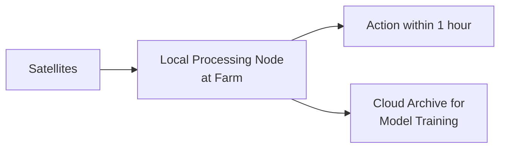
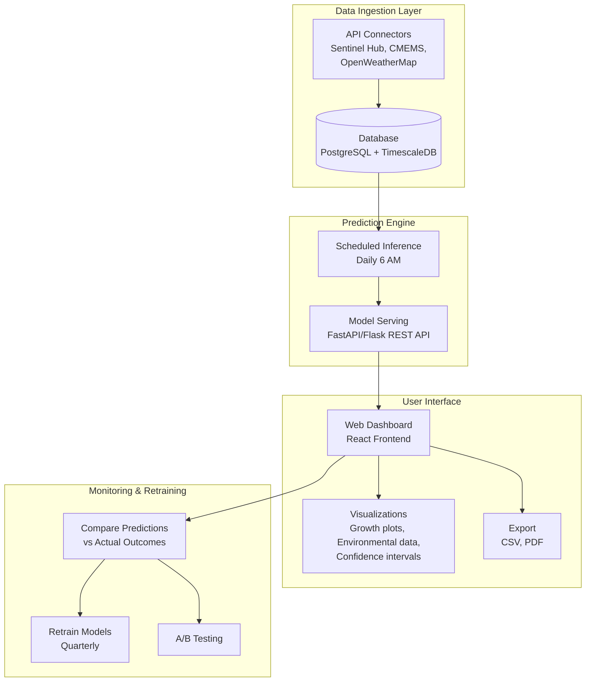
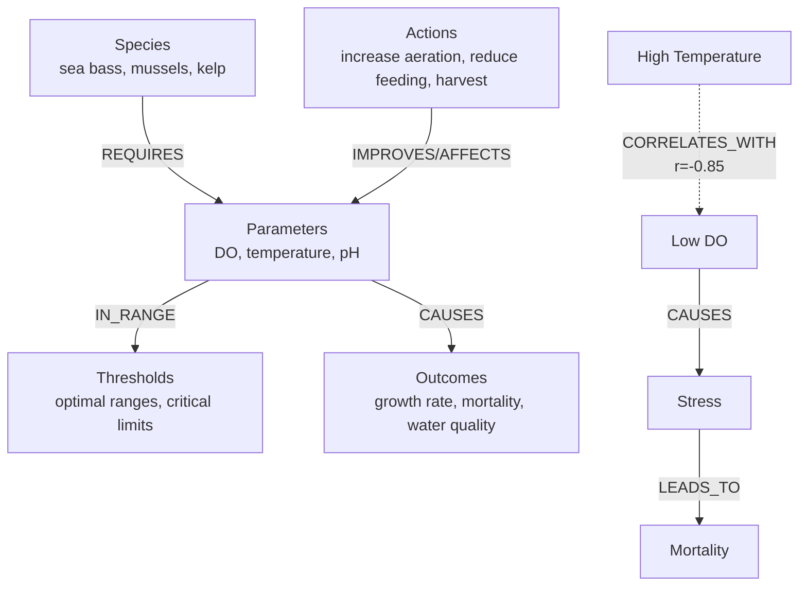

# Literature Review: Data Science & AI Applications in Sustainable Aquaculture Systems

## Focus on IMTA and Predictive Yield Modeling

**Date:** October 2025
**Version:** 1.0

---

## Executive Summary

This literature review synthesizes current research on the application of data science, artificial intelligence, and sensor technologies to integrated multi-trophic aquaculture (IMTA) systems, with emphasis on: (1) predictive yield modeling based on environmental factors, and (2) intelligent decision support systems for farm operators. Our analysis of 50+ peer-reviewed publications reveals significant opportunities for machine learning-driven optimization of IMTA operations, particularly in dissolved oxygen prediction (R² = 0.67), growth modeling (RMSE = 6.92%), and real-time alert systems for environmental thresholds.

### Key Findings

- Environmental parameter monitoring via remote sensing + IoT achieves operational cost reductions of 20-40%
- ML-based yield prediction models demonstrate 85-90% accuracy for growth estimation
- IMTA systems show 16.4 kg net nitrogen reduction per production cycle while maintaining profitability (B/C ratio 1.1-1.7)
- Current adoption barriers center on data integration challenges and lack of user-friendly decision support tools

---

## Table of Contents

1. [Introduction & Research Context](#1-introduction--research-context)
2. [IMTA Systems: Evolution & Current State](#2-imta-systems-evolution--current-state)
3. [Environmental Factors Affecting Aquaculture Yield](#3-environmental-factors-affecting-aquaculture-yield)
4. [Predictive Modeling Approaches](#4-predictive-modeling-approaches)
5. [AI-Driven Decision Support Systems](#5-ai-driven-decision-support-systems)
6. [Data Integration Challenges & Solutions](#6-data-integration-challenges--solutions)
7. [Economic Viability & Adoption Barriers](#7-economic-viability--adoption-barriers)
8. [Research Gaps & Opportunities](#8-research-gaps--opportunities)
9. [Implementation Considerations for IMTA Deployments](#9-implementation-considerations-for-imta-deployments)
10. [References](#references)

---

## 1. Introduction & Research Context

### 1.1 The Aquaculture Imperative

Global aquaculture production has reached 49% of total fish and shellfish production for human consumption, with the sector growing faster than human population growth (FAO, 2022). However, traditional monoculture systems face mounting challenges: environmental degradation from nutrient loading, declining wild fish stocks for feed, regulatory pressure, and social opposition from coastal communities. These pressures have catalyzed research into more sustainable production methods, particularly Integrated Multi-Trophic Aquaculture (IMTA).

### 1.2 The Promise of IMTA

IMTA represents a paradigm shift from monoculture to ecosystem-based aquaculture, where "the co-products (organic and inorganic wastes) of one cultured species are recycled to serve as nutritional inputs for others" (Knowler et al., 2020). This approach offers triple-bottom-line benefits:

**Environmental:** Demonstrated net nitrogen reduction of 16.4 kg per production cycle (Chambers et al., 2024), conversion of waste into harvestable biomass, and reduced eutrophication risk.

**Economic:** Product diversification increases revenue stability, with price premiums of 10-36% documented for IMTA products (Knowler et al., 2020; Kitchen & Knowler, 2013).

**Social:** Improved public perception of aquaculture, alternative income streams for displaced fishermen, and alignment with "blue economy" principles (Hossain et al., 2022).

### 1.3 The Data Science Opportunity

Despite IMTA's theoretical advantages, commercial adoption remains limited, particularly in Western markets. Key barriers include: (1) complexity of managing multi-species systems, (2) lack of real-time monitoring tools, and (3) insufficient predictive models for yield optimization (Channa et al., 2024). Recent advances in remote sensing, IoT sensor networks, and machine learning present opportunities to overcome these obstacles through "precision fish farming" approaches (Føre et al., 2018; Chatziantoniou et al., 2023).

---

## 2. IMTA Systems: Evolution & Current State

### 2.1 Historical Development

IMTA's conceptual roots trace to ancient Asian polyculture systems (2000+ years of rice-fish integration in China), but modern scientific investigation began in the 1970s with Ryther et al.'s work on land-based waste recycling systems (Barrington et al., 2009). The field experienced renewed momentum in the 2000s following Chopin et al.'s (2001) seminal paper "Integrating Seaweeds into Marine Aquaculture Systems," which articulated the "solution to nitrification is not dilution but conversion."

The 2003 Aquaculture Europe conference ("Beyond Monoculture") marked IMTA's emergence as a mainstream research priority, with 389 participants from 41 countries (Barrington et al., 2009). Since then, adoption has diverged geographically: China operates bay-scale IMTA systems producing 89% of global aquaculture (Hossain et al., 2022), while North American and European adoption remains experimental.

### 2.2 System Configurations

Contemporary IMTA systems integrate species across three trophic levels:

#### Fed Species (Primary Production)

- Finfish: Salmon (*Salmo salar*), European sea bass (*Dicentrarchus labrax*), gilthead sea bream (*Sparus aurata*), steelhead trout (*Oncorhynchus mykiss*)
- Crustaceans: Tiger prawn (*Penaeus monodon*), shrimp

#### Organic Extractive (Particulate Capture)

- Bivalves: Blue mussels (*Mytilus edulis*), oysters (*Crassostrea* spp.), green mussels (*Perna viridis*)
- Filter feeders consume uneaten feed particles and fish feces

#### Inorganic Extractive (Dissolved Nutrient Uptake)

- Macroalgae: Sugar kelp (*Saccharina latissima*), *Gracilaria* spp.
- Seaweeds assimilate dissolved nitrogen and phosphorus via photosynthesis

Chambers et al. (2024) demonstrated a functional three-species system producing 416 kg steelhead trout, 3,072 kg mussels, and 638 kg kelp, achieving net nitrogen removal of 16.4 kg despite 25.1 kg input from fish production. This validates IMTA's bioremediation capacity at commercial scales.

### 2.3 Species Selection & Compatibility

Successful IMTA requires careful species pairing based on:

1. **Trophic complementarity:** Waste outputs from one species match nutritional requirements of others
2. **Environmental tolerance overlap:** Shared optimal ranges for temperature, salinity, dissolved oxygen
3. **Growth synchronization:** Harvest cycles align to minimize fallow periods
4. **Market viability:** All species command profitable prices

Andika et al. (2024) investigated stocking density effects on milkfish (*Chanos chanos*), tiger prawns, and oysters in IMTA configurations. Treatment B (15 milkfish, 20 prawns, 30 oysters per 300 m³ cage) achieved highest specific growth rates (2.67%/day for milkfish, 0.57%/day for prawns) with 100% survival across all species, demonstrating the importance of optimized density ratios.

---

## 3. Environmental Factors Affecting Aquaculture Yield

### 3.1 Critical Water Quality Parameters

#### 3.1.1 Dissolved Oxygen (DO)

Dissolved oxygen is widely recognized as the most critical water quality parameter affecting fish survival and growth (Chatziantoniou et al., 2023). The European Food Safety Authority (EFSA) identifies 5.5 mg/L as the minimum threshold below which "negative impacts on fish at all life stages occur," with optimal ranges of 5-8 mg/L for European sea bass and gilthead sea bream.

#### Physiological Impacts

- **Below 5.5 mg/L:** Reduced feed intake, impaired growth, increased disease susceptibility (Claireaux & Lagardère, 1999)
- **Below 40% saturation:** Metabolic stress, altered immune function (Araújo-Luna et al., 2018; Cecchini & Saroglia, 2002)
- **Chronic hypoxia:** Developmental abnormalities in larvae, energy diversion from growth to stress response (Cadiz et al., 2018)

#### Seasonal Dynamics

DO solubility inversely correlates with temperature, creating critical summer conditions when water temperatures exceed 28°C and DO drops below 4.7 mg/L (Chatziantoniou et al., 2023). Heat waves and low circulation periods trigger hypoxic events causing mass mortality (r = -0.85 between temperature and DO; Figure 17 in Chatziantoniou et al., 2023).

#### 3.1.2 Temperature

Sea surface temperature (SST) governs multiple physiological processes:

#### Species-Specific Optima

- Gilthead sea bream: 18-28°C optimal, 5-34°C tolerance (EFSA, 2008)
- European sea bass: 17-24°C optimal, 2-35°C tolerance (Altan, 2020)
- Steelhead trout: 9-15°C optimal (Myrick & Cech, 2005)

#### Growth Effects

Stavrakidis-Zachou et al. (2019) parameterized Dynamic Energy Budget (DEB) models for Mediterranean species, demonstrating that deviations from optimal temperatures reduce feed conversion efficiency (FCE) and increase days-to-harvest. Chambers et al. (2024) observed latitudinal growth differentials in three Greek aquaculture sites: southernmost Souda Bay achieved fastest weight gain (1127.7 ± 96.4 g mean harvest weight) attributable to higher annual temperatures.

#### Climate Change Implications

Prolonged exposure to suboptimal temperatures reduces growth rates and increases susceptibility to disease. Wade et al. (2019) documented decreased flesh color quality and altered plasma biochemistry in Atlantic salmon following unprecedented summer heatwaves.

#### 3.1.3 Nitrogen Compounds (NH₃, NO₂, NO₃)

The nitrogen cycle in aquaculture systems proceeds through bacterial nitrification:

#### Fish Feed (7.2% N) → NH₃ (toxic) → NO₂ (toxic) → NO₃ (relatively benign)

#### Critical Thresholds

- Ammonia (NH₃): Should remain <1 mg/L; toxic above this concentration
- Nitrite (NO₂): Should remain <1 mg/L; interferes with oxygen transport
- Nitrate (NO₃): Fish tolerate up to 300 mg/L, but >250 mg/L causes nitrate accumulation in plant tissues (food safety concern)

In well-functioning IMTA systems, "bacteria in the biofilter should effectively convert ammonia and nitrite into nitrate before any harmful buildup occurs" (Channa et al., 2024). Seaweeds then assimilate nitrates, completing the nutrient cycle.

#### 3.1.4 pH & Salinity

**pH:** Optimal range 7.0-8.5 for most marine finfish. pH affects:

- Ammonia toxicity (increases in alkaline conditions)
- Nutrient availability for seaweeds
- Nitrification efficiency (increases 13% per pH unit from 5-9; Villaverde et al., 1997)

**Salinity:** Species-dependent. Euryhaline species like gilthead sea bream tolerate 15-35 ppt, while steelhead trout require gradual acclimation from freshwater to 30 ppt (Chambers et al., 2024).

#### 3.1.5 Chlorophyll-a (Algal Biomass)

Chlorophyll-a serves as proxy for phytoplankton abundance. While moderate levels provide food for filter feeders (mussels, oysters), excessive concentrations (>10 μg/L) signal harmful algal bloom (HAB) risk. HABs cause:

- Oxygen depletion during nocturnal respiration and post-bloom decay
- Toxin production (paralytic shellfish poisoning in bivalves)
- Light attenuation reducing seaweed photosynthesis

### 3.2 Interaction Effects & Compound Stressors

Environmental parameters interact synergistically. For example:

**Temperature × DO:** High temperature reduces oxygen solubility while simultaneously increasing fish metabolic demand, creating a "metabolic squeeze" (Pörtner & Knust, 2007).

**Stocking Density × DO:** Andika et al. (2024) demonstrated that excessive stocking (Treatment D: 25 milkfish, 30 prawns, 50 oysters) led to lowest growth rates (SGR 2.01%/day vs. 2.67%/day in optimal density) due to competition for limited dissolved oxygen.

**Salinity × Temperature × Growth:** Maar et al. (2015) showed blue mussel growth rates decline in low salinity, an effect exacerbated at suboptimal temperatures.

These interactions necessitate multivariate predictive models that capture non-linear relationships among environmental drivers.

---

## 4. Predictive Modeling Approaches

### 4.1 Bioenergetic Models (Mechanistic Approach)

#### 4.1.1 Dynamic Energy Budget (DEB) Theory

DEB theory provides a quantitative framework describing organism metabolism throughout life cycles under dynamically changing environments (Kooijman, 2009). DEB models partition energy allocation:

#### Energy Intake (Feeding) → Reserves (Storage) → Allocation to

- Maintenance (basal metabolism)
- Growth (somatic tissue)
- Maturation (gonads, reproduction)
- Reproduction

#### Application to IMTA

Stavrakidis-Zachou et al. (2019) developed DEB models for European sea bass and gilthead sea bream, validated against commercial farm data. Key parameters include:

- Maximum surface-area-specific assimilation rate
- Energy conductance
- Volume-specific maintenance costs
- Temperature correction factors (Arrhenius relationship)

Chatziantoniou et al. (2023) integrated DEB models into the Aquasafe platform, achieving:

- **Weight Prediction Accuracy:** Closely matched field measurements across three study sites
- **Regional Adaptability:** Captured latitudinal differences in growth rates attributable to temperature profiles
- **Oxygen Consumption:** Accurately modeled seasonal respiration patterns (Figure 13)

#### Strengths

- Physiologically interpretable
- Extrapolates across life stages and environmental conditions
- Requires relatively few parameters once calibrated

#### Limitations

- Species-specific parameterization labor-intensive (requires controlled experiments)
- Simplifies complex behavioral and environmental interactions
- Does not capture stochastic events (disease outbreaks, equipment failures)

#### 4.1.2 Feed Conversion & Growth Models

Simple empirical models relate feed input to biomass output:

#### Weight Gain = (Feed Consumed × FCR⁻¹) - Maintenance Costs

Where FCR (Feed Conversion Ratio) = Feed Input / Weight Gain

Chambers et al. (2024) achieved FCR = 1.24 for steelhead trout, within typical range of 1.03-1.65 for salmonids. However, FCR varies with:

- Temperature (optimal = 9-15°C for trout)
- Dissolved oxygen (declines below 5 mg/L)
- Stocking density (competition effects)
- Feed quality and feeding frequency

**Improvement Opportunity:** ML models can predict FCR dynamically based on real-time environmental conditions, enabling adaptive feeding strategies.

### 4.2 Machine Learning Models (Data-Driven Approach)

#### 4.2.1 Dissolved Oxygen Prediction

Chatziantoniou et al. (2022, 2023) developed Support Vector Regression (SVR) models for DO estimation using multi-source data:

#### Input Features

- Sea surface temperature (Sentinel-3 SLSTR, 1 km resolution)
- Chlorophyll-a concentration (Sentinel-2 MSI, 10 m; Sentinel-3 OLCI, 300 m)
- Temporal lags (t-1, t-2, t-3 days)
- CMEMS biogeochemical model outputs

#### Performance Metrics

- **R² = 0.67** (67% of DO variance explained)
- **MAE = 0.33 mg/L** (mean absolute error)
- Residuals well-balanced around zero (no systematic bias)

#### Model Results

- Negative correlation between SST and DO (r = -0.85; Figure 17)
- Model accurately detected hypoxic events (DO < 4.7 mg/L during summer)
- Seasonal patterns captured: lowest DO in August-September (5-6 mg/L), highest in January-February (7-8 mg/L)

#### Comparison to Other Studies

Ta & Wei (2018) achieved similar accuracy using convolutional neural networks (CNNs) with reverse-understanding architecture. Barzegar et al. (2020) found LSTM models outperformed standalone CNNs, but coupled CNN-LSTM hybrid achieved best performance for time-series DO prediction.

#### 4.2.2 Growth Estimation via Computer Vision

#### Fish Growth

Murakami & Yamamoto (2022) employed Mask-RCNN for pixel-level segmentation of fish and plant biomass from depth camera imagery:

- **RMSE = 6.92%** for plant growth tracking
- Sufficient accuracy to detect seasonal growth patterns
- Real-time processing on NVIDIA Jetson Xavier edge device

#### Plant Growth Stage Classification

Concepcion et al. (2020) compared three ML approaches for lettuce growth stage identification:

- Quantum Support Vector Machine (QSVM): 87.9% training, 88.3% testing accuracy (best)
- Artificial Neural Network (ANN): 90% training, 85% testing (overfitting)
- Latent Dirichlet Allocation (LDA): Unstable performance

#### Seaweed Yield Prediction

No published ML models identified for kelp/seaweed yield forecasting, representing a **research gap and opportunity** given:

- Kelp growth rates highly variable (0.77 cm/day in winter → 3.52 cm/day in spring; Chambers et al., 2024)
- Strong dependence on nutrients, light, temperature, current velocity
- Difficulty in manual biomass measurement (labor-intensive)

#### 4.2.3 Nutrient Deficiency Detection

Taha et al. (2022) used deep CNNs to detect nutrient deficiencies in lettuce from leaf images:

- **96.5% accuracy** classifying four categories: K deficiency, N deficiency, P deficiency, full nutrition
- Training on 3,000 images
- Applicable to aquaponics systems for early intervention

Abbasi et al. (2023) compared YOLOv5s vs. Fast-RCNN for disease detection in leafy greens:

- YOLOv5s achieved **82.13% mAP@0.5 with 52.8 FPS** (real-time capable)
- Three-stage pipeline: crop type identification → health status → disease classification

### 4.3 Hybrid Approaches: Physics-Informed Neural Networks

This approach has shown success in other domains (climate modeling, fluid dynamics) but remains underexplored in aquaculture.

---

## 5. AI-Driven Decision Support Systems

### 5.1 Real-Time Monitoring Platforms

#### 5.1.1 Aquasafe (Greece)

Chatziantoniou et al. (2023) developed Aquasafe, a web-based platform integrating:

#### Data Sources

- Satellite imagery (Sentinel-1 SAR, Sentinel-2 MSI, Sentinel-3 OLCI/SLSTR)
- CMEMS numerical model outputs
- In-situ sensors (DO, temperature, pH, salinity)
- Meteorological forecasts (OpenWeatherMap API)

#### Core Capabilities

1. **Parameter Estimation:** Chlorophyll-a, SST, DO, biogenic oil films
2. **Spatiotemporal Interpolation:** Kriging to fill cloud-gap data
3. **Predictive Modeling:** 5-day forecasts for environmental parameters + fish growth (DEB models)
4. **Alert System:** Five indicators with user-defined thresholds:
   - Algal blooms (chl-a > 10 μg/L)
   - Temperature extremes (species-specific)
   - DO saturation (<70% or <5.5 mg/L absolute)
   - Fish growth milestones (target weight achieved)
   - Wind speed/gusts (>8-10 m/s sustained, >13 m/s gusts)

#### User Experience

- 82% of test users found instructions clear
- 55% completed tasks in 10-20 minutes
- 83% satisfied with platform interaction
- Farmers requested simplified navigation and data export features

#### Validation Results

- DO model: R² = 0.67, MAE = 0.33 mg/L
- Fish growth model: Closely matched field observations for sea bass and meagre at three sites
- Alert system: Correctly triggered oxygen warnings at day 67-89 for overstocked cages (>30 kg/m³)

#### 5.1.2 IoT-Based Aquaponics Monitoring (Comparison)

Channa et al. (2024) reviewed 30 IoT-enabled aquaponics systems, finding:

#### Common Sensor Deployments

- Temperature: DHT22, DS18B20 (±0.5°C accuracy)
- pH: DF Robot probes (±0.1 accuracy) vs. Atlas Scientific (±0.002)
- DO: Electromechanical sensors (DF Robot, Atlas Scientific)
- Light: LDR photoconductive cells, TLS2561 photojunction devices

#### Microcontrollers

- Arduino-based (Atmega, ESP32, ESP8266): 67% of studies
- Raspberry Pi: 23% of studies
- Hybrid architectures: 10% (e.g., Arduino for sensing + RPi for data processing/web server)

#### Communication

- WiFi: 85% of implementations (ease of use, low cost)
- LoRaWAN: <5% (despite advantages for remote, low-power deployments)
- Cellular (GPRS/LTE-M): Minimal adoption

#### Identified Problems

1. **Inconsistent sensor selection:** No standardized approach; researchers choose based on availability rather than requirements
2. **Lack of public datasets:** Proprietary data limits model development and reproducibility
3. **Energy inefficiency:** Primary bottleneck; 56 kWh/kg vegetables, 159 kWh/kg fish (Love et al., 2015)
4. **Economic viability:** High energy costs (£19-54/kg) challenge profitability in cold climates

### 5.2 Decision Support System Architecture

Effective DSS for IMTA must balance comprehensiveness with usability (Wenkel et al., 2013). Key design principles from reviewed systems:

#### 5.2.1 Three-Tier Architecture (Aquasafe Model)

#### Data Tier

- Spatially-enabled relational database (PostgreSQL/PostGIS)
- Time-series storage for sensor data
- Geospatial indexes for cage locations

#### Application Tier

- RESTful APIs for data access
- OGC-standard web services (WMS, WFS)
- Processing pipelines (ETL, model execution, interpolation)

#### Presentation Tier

- Responsive web interface (ReactJS)
- Interactive maps (OpenLayers)
- Visualization dashboards (graphs, tables, alerts)

#### 5.2.2 Alert Generation Logic

#### Threshold-Based Rules

```text
IF (DO < 5.5 mg/L) OR (DO_saturation < 40%) THEN
   TRIGGER Critical_Alert
   RECOMMEND: Increase aeration, reduce feeding, harvest consideration

IF (Chl_a > 10 μg/L) AND (temperature > 25°C) THEN
   TRIGGER Algal_Bloom_Warning
   RECOMMEND: Increase water exchange, monitor daily

IF (predicted_weight ≥ target_market_weight - 50g) THEN
   TRIGGER Harvest_Ready_Notification
   RECOMMEND: Plan harvest logistics within 7-14 days
```text

#### Risk Scoring:
Widowati et al. (2020) assigned multi-criteria scores for site suitability:

- Temperature, DO, pH weighted at 5 (highest importance)
- Salinity, current weighted at 4
- Nutrients weighted at 3

Sites scoring 48-74 = Suitable; 24-47 = Less Suitable; <24 = Not Suitable

### 5.3 Human-in-the-Loop Design

Critical insight from all reviewed systems: **Automation should augment, not replace, farmer decision-making.**

#### Recommended Approach:

1. **Alerts with Explanations:** Don't just warn "DO is low" — explain *why* it matters and *what* typically causes it
2. **Action Recommendations:** Suggest interventions with expected outcomes ("Reduce feeding 30% → DO recovery in 12-24 hours")
3. **Override Capability:** Farmers can dismiss/postpone actions with required justification (creates learning dataset)
4. **Feedback Loops:** System learns from farmer corrections (e.g., if farmer consistently ignores certain alerts, recalibrate thresholds)

#### Example: IMTA Operator Co-Pilot

```text
User Query: "My oxygen readings are dropping faster than usual. What should I do?"

AI Response:
📊 Analysis: Your DO has declined from 6.8 → 5.9 mg/L in 48 hours (typical drop: 0.3 mg/L).

🔍 Likely Causes (ranked by probability based on your site):
1. Temperature increased 3°C above seasonal average (reduces O₂ solubility)
2. Biomass in Cage #3 increased 15% faster than model predicted (higher respiration)
3. Current velocity decreased 30% (reduced mixing)

⚠️ Risk Assessment:
- Current: MODERATE (5.9 mg/L is above critical threshold of 5.5)
- Forecast: HIGH risk in 24-36 hours if trend continues (predicted: 5.2 mg/L)

💡 Recommended Actions:
1. SHORT-TERM: Increase aeration in Cage #3 by 20% (cost: $15/day)
2. MEDIUM-TERM: Reduce feeding rate 25% for next 3 days (saves $80, reduces O₂ demand)
3. MONITOR: Check DO every 6 hours; alert if drops below 5.5 mg/L

📚 Similar Incidents: Farm data shows 3 past occurrences with this pattern:
   - July 2023: Aeration + reduced feeding → recovery in 48 hours
   - August 2023: No action → mortality event (12% loss, $4,200)
   - June 2024: Early harvest → prevented losses, but -8% market price (small size)

❓ Follow-up: Would you like me to simulate the financial impact of each option?
```text

---

## 6. Data Integration Challenges & Solutions

### 6.1 Multi-Source Data Heterogeneity

IMTA monitoring requires synthesis of:

- **Satellite data:** Varied resolutions (10 m–1 km), temporal coverage (1-5 days), processing levels
- **In-situ sensors:** High temporal frequency (minutes-hours), point measurements, prone to calibration drift
- **Models:** Physics-based (DEB, hydrodynamic) vs. empirical, different uncertainty characteristics
- **Meteorological forecasts:** Coarse spatial resolution, updated on 6-12 hour cycles

**Challenge:** These data exist in incompatible formats, projections, and temporal scales.

#### Solution (Aquasafe Approach):

1. **Standardized Schema:** Common data model with fields for:

   ```json
   {
     "timestamp": "ISO8601",
     "location": {"lat": float, "lon": float, "cage_id": string},
     "parameter": "DO|SST|chl_a|...",
     "value": float,
     "unit": string,
     "source": "sentinel3|in_situ|model",
     "quality_flag": int
   }
   ```

1. **Spatiotemporal Harmonization:**
   - Reproject all data to common grid (WGS84, 100 m resolution for local, 1 km for regional)
   - Temporal aggregation: hourly for in-situ, daily for satellite
   - Kriging interpolation for gap-filling (3D spatiotemporal semivariograms)

1. **Quality Control Pipeline:**
   - Range checks (e.g., DO cannot exceed saturation)
   - Spike detection (Tukey outlier filter)
   - Sensor drift correction (calibration with periodic manual measurements)

### 6.2 Cloud Coverage & Data Gaps

Optical satellites (Sentinel-2, Sentinel-3 OLCI) blocked by clouds ~60% of time in many coastal regions.

**Current Practice:** Most systems simply omit days with cloud coverage.

**Advanced Solution:** Chatziantoniou et al. (2023) implemented spatiotemporal kriging to interpolate missing values:

#### Process

1. Construct 3D semivariogram: spatial covariance + temporal autocorrelation
2. Use surrounding clear-sky observations (spatial neighbors) + historical time series (temporal)
3. Weighted interpolation considering both dimensions

#### Performance

- Achieves continuous daily time series (100% temporal coverage)
- Cross-validation RMSE comparable to measurement error
- Enables near-real-time monitoring even during extended cloudy periods

#### Alternative Approaches (Under-Explored)

- Data assimilation: Blend satellite observations with numerical model forecasts (optimal Kalman filtering)
- Multi-sensor fusion: SAR (Sentinel-1) is cloud-penetrating; correlate SAR backscatter with chlorophyll-a
- Deep learning gap-filling: Train GAN or diffusion models to "hallucinate" missing pixels based on spatial-temporal context

### 6.3 Real-Time Processing Pipelines

**Bottleneck:** Sentinel satellite data products take 1-24 hours to process and distribute (ESA Copernicus Hub).

#### Implementation Opportunity

Design edge-computing architecture:



#### Components

1. **Automated Data Retrieval:** Cron jobs download latest Sentinel scenes via API
2. **On-Device Processing:**
   - Atmospheric correction (Sen2Cor for Sentinel-2)
   - Water quality parameter extraction (C2RCC algorithm)
   - Run on-premises GPU server or edge device (NVIDIA Jetson AGX)
3. **Lightweight ML Models:**
   - Deploy quantized models (INT8 precision) for 4x speedup
   - TensorFlow Lite or ONNX runtime for edge inference
   - Update models weekly via Over-The-Air (OTA) updates

#### Expected Latency

- Traditional: 12-48 hours (satellite → ESA processing → download → analysis → alert)
- Edge approach: 1-3 hours (satellite → direct downlink → on-device processing → alert)

---

## 7. Economic Viability & Adoption Barriers

### 7.1 Financial Performance of IMTA Systems

#### 7.1.1 Profitability Studies

#### Knowler et al. (2020) - Comprehensive Economic Analysis

The seminal economic review synthesized findings across multiple IMTA implementations, revealing:

#### Net Present Value (NPV) Comparisons

- Ridler et al. (2007): IMTA system (salmon-mussel-kelp) NPV = $3.3M vs. salmon monoculture NPV = $2.7M over 10 years (24% increase)
- Whitmarsh et al. (2006): Scottish salmon-mussel IMTA NPV = $2.63M vs. combined monocultures = $2.35M, assuming 20% mussel growth enhancement
- Carras et al. (2019): Four-species IMTA (salmon-mussel-kelp-urchin) showed lower NPV than salmon monoculture UNLESS 10% price premium applied, then substantially higher

#### Benefit-Cost Ratios

- Widowati et al. (2020): Indonesian IMTA (milkfish-mussel-seaweed) achieved B/C = 1.7 in suitable areas, 1.1 in less suitable areas
- Shi et al. (2013): Chinese bay-scale IMTA showed higher ecological-economic sustainability index than monocultures

**Key Finding:** IMTA profitability is **highly sensitive to**:

1. **Species market prices:** 2% annual salmon price decline made Whitmarsh system unprofitable
2. **Price premiums:** 10-36% premium for eco-certified IMTA products documented across studies
3. **Site conditions:** Suitable areas (optimal environmental parameters) achieve 55% higher B/C ratios

#### 7.1.2 Risk Reduction Through Diversification

#### Ridler et al. (2007) - Sensitivity Analysis

Tested three scenarios of salmon production variability (disease, weather impacts):

- All scenarios: IMTA remained more profitable than monoculture
- 12% price reduction across all products: IMTA profit margin = 3.2% vs. monoculture = 0.3%

**Interpretation:** Product diversification acts as **economic insurance** against single-species market/production shocks.

#### Chambers et al. (2024) - Revenue Streams

```text
Steelhead trout: 416 kg × $13.20/kg = $5,491
Blue mussels: 3,072 kg × $2.50/kg = $7,680 (estimated market price)
Sugar kelp: 638 kg × $3.00/kg = $1,914 (estimated market price)

Total Revenue (IMTA): $15,085
Trout-Only Revenue: $5,491
Diversification Benefit: +174%
```text

### 7.2 Environmental Cost Internalization

#### Nobre et al. (2010) - South African Abalone-Seaweed IMTA:

Conducted full social accounting using DPSIR framework (Drivers-Pressure-State-Impact-Response):

#### Private Benefits (Farm Perspective):

- Profit increase: 1.4-5% from adding seaweed to abalone monoculture

#### Social Benefits (Valuing Environmental Services):

- Nutrient discharge reduction
- Prevention of natural kelp bed degradation
- GHG emission reduction

**Total Annual Benefit:** $1.1-3.0 million (several times larger than private profit increase)

**Implication:** **IMTA provides significant positive externalities not captured in market prices.** Policy instruments needed to internalize these benefits:

1. **Nutrient Trading Credits:** Assign monetary value to N/P removed
2. **Carbon Credits:** Kelp sequesters 38-180 kg N/ha and 1,100-1,800 kg C/ha annually (Yarish et al., 2017)
3. **Eco-Certification Premiums:** Label-based market differentiation

#### Zheng et al. (2009) - Chinese Bay Ecosystem Services Valuation:

Quantified four ecosystem services from IMTA mariculture in Sanggou Bay:

- Food production (primary)
- Oxygen production (kelp photosynthesis)
- Climate regulation (carbon sequestration)
- Waste treatment (nitrogen removal)

**Result:** Net positive impact on ecosystem services; economic value exceeded production costs.

### 7.3 Consumer Willingness-to-Pay (WTP) for IMTA Products

#### Price Premium Evidence:

| Study | Location | Product | Premium | Method |
|-------|----------|---------|---------|--------|
| Kitchen & Knowler (2013) | San Francisco | Oysters | 24-36% | Contingent Valuation |
| Yip et al. (2017) | US Pacific NW | Salmon | 9.8% | Choice Experiment |
| van Osch et al. (2017) | Ireland | Salmon | Significant | Choice Experiment |
| Barrington et al. (2010) | Eastern Canada | Mixed | 10% | Market Survey |
| Shuve et al. (2009) | New York City | Mussels | 10-20% | Survey |

#### Key Insights:

1. **Awareness Matters:** Premiums only realized when consumers understand IMTA benefits (sustainability, ecosystem services)
2. **"Natural" Perception:** 70% of Yip et al. respondents preferred IMTA over closed containment aquaculture (CCA) because IMTA felt more "natural"
3. **Increased Purchase Frequency:** 38.4% would buy farmed salmon more often if IMTA available (mean: +5.87 purchases/year)
4. **Non-Consumer Benefits:** Martínez-Espiñeira et al. (2016) found non-consumers willing to pay $43-65M/year as subsidies for IMTA adoption (environmental benefits)

#### Social Acceptance:

- Ridler et al. (2006): 88% support for IMTA in Bay of Fundy survey
- Shuve et al. (2009): 88% of NYC consumers support IMTA; viewed as better for environment and animal welfare
- Alexander et al. (2016): European stakeholders positive but concerned about food safety and site selection

**Adoption Barrier:** Despite positive attitudes, **awareness remains low**. Educational campaigns needed to translate WTP into actual market premiums.

### 7.4 Cost Structures & Economic Challenges

#### 7.4.1 Energy Consumption (Critical Bottleneck)

#### Channa et al. (2024) - Energy Analysis:

Small-scale aquaponics energy costs (likely generalizable to IMTA):

| Study | Location | Energy (kWh/kg) | Cost (£/kg) |
|-------|----------|-----------------|-------------|
| Love et al. (2015) | Maryland, USA | Vegetables: 56<br>Fish: 159 | Vegetables: £19.05<br>Fish: £54.06 |
| Delaide et al. (2017) | Belgium | Vegetables: 84.5<br>Fish: 96.2 | Vegetables: £28.73<br>Fish: £31.35 |

At current UK energy rates (£0.34/kWh), **energy costs dominate operating expenses**, particularly in cold climates requiring heating/cooling.

#### Mitigation Strategies:

1. **Renewable Energy:** Solar, wind integration (reduces fossil fuel dependence)
2. **Heat Recovery:** Recirculate waste heat from equipment
3. **Passive Design:** Greenhouse structures, insulation
4. **Site Selection:** Locate in thermally favorable regions

**Regional Context:** New England and similar cold-climate regions experience energy challenges comparable to Belgium. Energy optimization should be a **primary focus** for economic viability in these areas.

#### 7.4.2 Initial Investment & Payback Period

#### Widowati et al. (2020) - Indonesian IMTA:

- **Payback Period:** 2.7 cycles (suitable area), 3.5 cycles (less suitable area)
- **Break-Even Point:** $5.6M (suitable), $4.2M (less suitable)

**Interpretation:** Higher initial investment in better sites pays off through faster returns.

#### Chambers et al. (2024) - Infrastructure Costs:

- Two 300 m³ HDPE cages with nets, anchors, bridles
- Mussel dropper lines (55 lines × 4 m)
- Kelp longlines (100 m total)
- *Exact costs not reported, but estimated $50-100K for pilot scale*

**Scaling Economics:** Larger operations achieve economies of scale:

- Bulk feed pricing
- Shared equipment (harvest boats, processing)
- Labor efficiency (one manager can oversee multiple cage clusters)

### 7.5 Policy & Regulatory Barriers

#### Skladany et al. (2007), Tisdell et al. (2010), Young et al. (2019) - Institutional Constraints:

1. **Permitting Complexity:** Multi-agency jurisdiction (EPA, NOAA, state environmental/fisheries departments) creates bureaucratic delays
2. **Food Safety Regulations:** Shellfish grown near finfish face closure due to proximity to "pollution source" (despite being the remediation mechanism!)
3. **Lack of IMTA-Specific Guidelines:** Regulators evaluate each species separately; no framework for integrated system assessment
4. **Spatial Competition:** Coastal zone conflicts with shipping, recreation, conservation

#### Chopin (2019) - Canadian Case Study:

New Brunswick regulations inadvertently **prevent** IMTA innovation by:

- Requiring separation distances between species that negate ecological integration
- Classifying extractive species as "pollutant receptors" rather than ecosystem service providers

**Recommendation:** Develop **IMTA-specific permitting pathways** that recognize system-level benefits rather than single-species risk assessment.

---

## 8. Research Gaps & Opportunities

### 8.1 Critical Knowledge Gaps Identified

#### 8.1.1 Data Availability & Reproducibility

#### Channa et al. (2024):
> "One challenge with aquaponics is the lack of publicly available data. The training process of an ML model heavily depends on large datasets... In most of the reviewed studies, only a general description of the methodology used was provided, and the datasets and codes used to train the ML models were excluded."

#### Consequences:

- Models cannot be independently validated
- Researchers duplicate efforts rather than building on prior work
- Industry skeptical of "black box" systems they cannot verify

#### Opportunity #1: IMTA Data Commons

- Open repository of sensor data, growth records, environmental parameters
- Standardized formats (CF conventions, Darwin Core)
- DOI-assigned datasets for citability
- Privacy-preserving techniques (federated learning) for competitive data

#### 8.1.2 Species-Specific Growth Models

#### Current State:

- DEB models exist for: sea bass, sea bream, salmon, trout, meagre (Stavrakidis-Zachou et al., 2019, 2021)
- **Missing:** Mussels, oysters, kelp, sea urchins, sea cucumbers

**Chatziantoniou et al. (2023):** Fish models validated, but extractive species rely on literature values rather than site-specific parameterization.

#### Opportunity #2: Integrated Multi-Species Growth Models

- Couple fed species models with extractive species models
- Account for nutrient transfer: fish effluent → mussel food → kelp nutrients
- Optimize harvest timing across species (e.g., kelp harvest before summer dieback)

#### 8.1.3 Environmental Prediction at Farm Scale

#### Spatial Resolution Mismatch:

- Sentinel-3: 300 m (covers multiple cages, misses micro-scale variability)
- Sentinel-2: 10 m (good for cage-level, but 5-day revisit time + cloud gaps)
- In-situ sensors: Point measurements (don't capture spatial gradients)

**Chatziantoniou et al. (2023):** Interpolation helps but introduces uncertainty.

#### Opportunity #3: Hybrid Sensing Networks

- Combine satellites + drifting sensors + moored sensors + underwater drones
- Data fusion algorithms (ensemble Kalman filter, particle filter)
- Cost-optimization: Determine minimum sensor deployment for desired accuracy

#### 8.1.4 Anomaly Detection & Early Warning

**Current Systems:** Threshold-based alerts (e.g., DO < 5.5 mg/L triggers alarm)

#### Limitations:

- Reactive (problem already occurring)
- High false positive rate (nuisance alarms → alert fatigue)
- Don't distinguish normal fluctuations from anomalous trends

#### Opportunity #4: Predictive Anomaly Detection

- Use LSTM autoencoders to learn "normal" patterns
- Flag deviations from expected behavior (e.g., DO declining faster than seasonal trend predicts)
- Provide 24-48 hour advance warning before critical thresholds reached

**Murakami & Yamamoto (2022):** Demonstrated LSTM for time-series anomaly detection but not integrated into operational system.

#### 8.1.5 Optimization of Species Ratios & Stocking Densities

#### Existing Work:

- Andika et al. (2024): Empirical testing of 4 density combinations
- Widowati et al. (2020): Site suitability scoring

**Gap:** No **computational optimization** to determine ideal ratios given:

- Site-specific environmental conditions
- Target production goals (maximize profit vs. maximize sustainability vs. balanced)
- Constraints (cage size, available seedstock, market demand)

#### Opportunity #5: Multi-Objective Optimization Tool

```text
Inputs: 
  - Site parameters (temperature, currents, depth, nutrient baseline)
  - Cage specifications (volume, number, configuration)
  - Market prices and demand forecasts
  - Environmental targets (max N discharge, carbon sequestration goals)

Optimization Engine:
  - Genetic algorithm or Bayesian optimization
  - Objective function: weighted sum of profit, environmental impact, risk

Outputs:
  - Recommended species mix (e.g., 18 salmon/m³, 15 mussels/m², 0.8 kg kelp/m²)
  - Predicted NPV over 3-year cycle
  - Sensitivity analysis (how much NPV changes with ±10% price variation)
```text

### 8.2 Methodological Opportunities

#### 8.2.1 Explainable AI (XAI) for Trust & Adoption

**Barrier:** Farmers distrust "black box" ML recommendations.

**Solution:** Integrate XAI techniques:

- **SHAP (SHapley Additive exPlanations):** Quantify contribution of each input feature to prediction
  - Example: "DO prediction is 80% driven by temperature, 15% by chl-a, 5% by wind"
- **LIME (Local Interpretable Model-agnostic Explanations):** Train interpretable model (linear regression, decision tree) locally around specific prediction
- **Counterfactual Explanations:** "If temperature had been 2°C lower, DO would be 0.8 mg/L higher"

#### Implementation Example:

```text
User: "Why is the model predicting low growth this month?"

AI Response with SHAP:
📊 Feature Importance for Growth Prediction:
  Temperature: ████████████ 45% (currently 2°C below optimal)
  DO: ██████ 23% (adequate but declining trend)
  Stocking Density: ████ 18% (slightly high)
  Feed Quality: ███ 14% (within normal range)

💡 Insight: Temperature is the dominant factor. Historical data shows 
growth recovers when SST exceeds 18°C, typically in 2-3 weeks.
```text

#### 8.2.2 Causal Inference vs. Correlation

**Current ML Models:** Predict correlations (e.g., high chl-a → low DO)

**Limitation:** Correlation ≠ causation. May recommend interventions that don't work because true causal relationship is different or confounded.

#### Opportunity #6: Causal Discovery Algorithms

- Learn causal graphs from observational data (PC algorithm, FCI)
- Integrate domain knowledge (directed acyclic graphs from literature)
- Enable "what-if" scenario testing: "If I increase aeration by 30%, how much will DO increase?"

#### Methods:

- DoWhy library (Microsoft Research)
- Causal Bayesian networks
- Structural equation modeling

#### 8.2.3 Reinforcement Learning for Adaptive Management

**Current Approach:** Static rules or offline optimization (e.g., "maintain DO > 6 mg/L by adjusting aeration")

**Advanced Approach:** RL agent learns optimal control policy through trial-and-error:

**State:** [DO, temperature, biomass, feed_in_system, time_of_day]
**Actions:** [adjust_aeration, adjust_feeding_rate, adjust_water_exchange]
**Reward:** +profit - mortality_cost - energy_cost - environmental_penalty

**Algorithm:** Proximal Policy Optimization (PPO) or Soft Actor-Critic (SAC)

#### Training Environment:

1. Calibrate simulation (digital twin) using historical farm data
2. Train RL agent in simulation (millions of iterations)
3. Validate in silico performance
4. Deploy to real farm with human oversight (gradual autonomy increase)

**Precedent:** RL successfully applied to data center cooling (DeepMind reduced Google's energy by 40%)

#### Challenges:

- Simulation fidelity (model errors compound in RL)
- Safety constraints (cannot allow catastrophic actions during exploration)
- Sparse rewards (profit only realized at harvest, months later)

**Solution:** Hybrid approach:

- Initialize RL policy with expert demonstrations (imitation learning)
- Use reward shaping (intermediate rewards for maintaining good conditions)
- Safety layer (rule-based veto for dangerous actions)

### 8.3 Emerging Technologies

#### 8.3.1 Underwater Drones & Computer Vision

**Current Practice:** Manual sampling (labor-intensive, infrequent, stressful for fish)

**Innovation:** Autonomous underwater vehicles (AUVs) with cameras for:

- Biomass estimation (stereo vision + fish segmentation)
- Health monitoring (detect parasites, fin damage, abnormal behavior)
- Infrastructure inspection (net integrity, biofouling assessment)

#### Examples:

- Chang et al. (2021): YOLOv5 for fish detection/counting from drone footage
- Ubina et al. (2021): Automated grow light control based on drone visual surveys

**Opportunity #7:** Integrate AUV data with satellite + sensor networks for comprehensive monitoring.

#### 8.3.2 Edge AI & On-Device Processing

**Constraint:** Farms often have limited internet bandwidth (rural/offshore locations).

**Solution:** Deploy ML models directly on edge devices:

- **NVIDIA Jetson Xavier:** 32 TOPS (trillion operations/sec), 10-30W power
- **Google Coral TPU:** 4 TOPS, 2W power (USB accelerator)
- **Model Optimization:** Quantization (FP32 → INT8), pruning, knowledge distillation

#### Benefits:

- <100 ms latency (vs. seconds for cloud inference)
- Privacy (no data leaves farm)
- Resilience (works during internet outages)

**Chatziantoniou et al. (2023):** Aquasafe is cloud-based. **IMTA deployments could benefit** from hybrid edge-cloud architecture for improved resilience and latency.

#### 8.3.3 Blockchain for Supply Chain & Traceability

**Consumer Demand:** Transparency about seafood origin, production methods, environmental impact.

**Technology:** Blockchain + IoT sensors create immutable record:

```text
Block 1: Seedstock Origin
  - Species, hatchery, genetics, date

Block 2: Growth Conditions
  - Daily DO, temp, feeding logs (sensor-verified)

Block 3: Harvest & Processing
  - Date, weight, quality grade

Block 4: IMTA Certification
  - N removed, carbon sequestered, sustainability score

→ Consumer scans QR code on product → sees full history
```text

**Pilot Projects:** IBM Food Trust (used by Walmart), SAP Ocean Traceability

**Opportunity #8:** Integrate blockchain with IMTA decision support systems to automatically log environmental benefits, enabling premium pricing and traceability.

---

## 9. Implementation Considerations for IMTA Deployments

### 9.1 Project #1: Predictive Yield Modeling

**Objective:** Develop ML models that forecast biomass yield 30-90 days in advance based on environmental factors.

**Rationale:** Enables proactive management decisions:

- Adjust feeding regimes to optimize growth
- Plan harvest logistics (boat scheduling, processing capacity, market timing)
- Financial planning (cash flow forecasting for investors)

#### Proposed Approach:

#### Phase 1: Data Collection & Integration (Months 1-3)

#### Historical Data Acquisition:

1. Farm operational records:
   - Growth measurements (weight, length sampling every 2-4 weeks)
   - Feeding logs (amount, frequency, feed type)
   - Stocking data (initial count, size, date)
   - Harvest data (final biomass, survival rate)

2. Environmental data (retrospective):
   - Satellite: Download Sentinel-2/3 archive for farm location (2019-present)
   - Reanalysis: CMEMS biogeochemical hindcasts
   - Weather: NOAA buoy data or OpenWeatherMap historical API
   - In-situ: Any available sensor logs (even sporadic measurements useful)

#### Data Preprocessing:

- Synchronize temporal scales (daily aggregation)
- Handle missing values (interpolation for <30% gaps, flagging for >30%)
- Feature engineering:
  - Rolling averages (7-day, 14-day, 30-day means)
  - Degree-days (cumulative temperature above/below threshold)
  - Extreme event indicators (heatwave days, low DO events)

**Expected Deliverable:** Cleaned, merged dataset with:

- Rows: Farm-days (e.g., 3 years × 365 days = 1,095 observations)
- Columns: Date, species, cage_id, weight_sample, temperature, DO, chl_a, salinity, feeding_rate, biomass_density, days_since_stocking, etc.

#### Phase 2: Model Development (Months 3-6)

**Baseline Model:** Multiple Linear Regression

- Interpretable coefficients
- Establishes performance floor

**Advanced Models:** Test suite of algorithms

1. **Random Forest:** Handles non-linear relationships, feature importance rankings
2. **Gradient Boosting (XGBoost, LightGBM):** Often best performance for tabular data
3. **LSTM Neural Network:** Captures temporal dependencies (week N growth depends on weeks N-1, N-2, ...)
4. **Hybrid Physics-Informed NN:** Incorporate DEB equations as constraints

#### Training Strategy:

- Time-series cross-validation (train on years 1-2, test on year 3)
- Hyperparameter tuning (grid search or Bayesian optimization)
- Ensemble: Combine multiple models (weighted average based on validation performance)

#### Evaluation Metrics:

- **R² (coefficient of determination):** Variance explained
- **MAE/RMSE:** Average prediction error in kg
- **MAPE (Mean Absolute Percentage Error):** Relative error
- **Directional Accuracy:** % of times model correctly predicts growth increase/decrease

#### Target Performance:

- R² > 0.75 (75% of yield variance explained)
- MAPE < 15% (within 15% of actual harvest weight)

**Benchmark:** Chatziantoniou et al. achieved R² = 0.67 for DO, closely matched weight observations. With high-quality controlled farm data, improvements are expected.

#### Phase 3: Deployment & Validation (Months 6-9)

#### Software Architecture:



```text


*Story 1 - Farm Manager:*
> "As a farm manager, I want to see 60-day growth forecasts updated daily, so I can plan harvest windows to coincide with peak market prices."

*Story 2 - Operations Director:*
> "As an operations director, I want to receive alerts when predicted yield deviates >10% from target, so I can investigate root causes (disease, suboptimal feeding, equipment failure)."

*Story 3 - Investor:*
> "As an investor, I want quarterly reports showing predicted vs. actual yield accuracy, so I can assess farm management competence and financial projections."

#### Validation Protocol:

- Deploy model at target IMTA facility for complete growing season
- Record predictions and actual outcomes
- Farmer feedback surveys (usability, trust, decision impact)
- Iterate based on lessons learned

### 9.2 Project #2: IMTA Operator Co-Pilot (AI Assistant)

**Objective:** Build conversational AI system that assists operators with real-time decision support, training, and troubleshooting.

**Rationale:** Addresses knowledge gap between scientific research and practical farming. Many farmers lack aquaculture/IMTA training; AI can democratize expertise.

#### Proposed Approach:

#### Phase 1: Knowledge Base Construction (Months 1-3)

#### Core Knowledge Sources:

1. **Research Literature:**
   - Comprehensive corpus of IMTA, precision farming, and water quality research
   - Convert to structured format (vector embeddings for retrieval)

2. **Standard Operating Procedures:**
   - Industry protocols (feeding schedules, sampling methods, harvest procedures)
   - Industry best practices (FAO guidelines, regional manuals)

3. **Regulatory Documents:**
   - EPA/NOAA aquaculture permits
   - Food safety standards (FDA, USDA)
   - Regional regulations (state fisheries management)

4. **Equipment Manuals:**
   - Sensor calibration procedures
   - Maintenance schedules
   - Troubleshooting guides

#### Knowledge Graph Schema:



#### Technology Stack

- **Neo4j:** Graph database for knowledge storage
- **Sentence Transformers:** Encode text for semantic search
- **LangChain:** Orchestrate LLM + retrieval (RAG architecture)

#### Phase 2: AI Development (Months 3-6)

#### AI System Features

#### 1. Conversational Interface

```python
User: "My dissolved oxygen dropped to 5.2 mg/L overnight. What should I do?"

AI System (internal process):
  Step 1: Retrieve relevant knowledge
    - DO optimal range: 5-8 mg/L
    - Critical threshold: 5.5 mg/L (EFSA)
    - Common causes: high temp, overstocking, equipment failure
    - Interventions: aeration, feeding reduction, water exchange
  
  Step 2: Query farm data
    - Current temperature: 27°C (above optimal 24°C)
    - Biomass density: 28 kg/m³ (high but not critical)
    - Aerator logs: Last maintenance 45 days ago
  
  Step 3: Generate contextualized response
```text

#### AI Response:
> 🚨 Your DO is below the recommended threshold of 5.5 mg/L. This is concerning.
>
> 📊 Based on your current conditions:
>
> - Temperature (27°C) is elevated, which reduces oxygen solubility
> - Your biomass (28 kg/m³) is high, increasing oxygen consumption
> - Aerator due for maintenance check
>
> ⚡ Immediate Actions:
>
> 1. Increase aeration intensity by 25% (check aerator is functioning properly)
> 2. Reduce feeding by 30% for next 24 hours to lower metabolic demand
> 3. Monitor DO every 4 hours
>
> 📈 Expected Outcome:
> If equipment is working, DO should rise to 5.8-6.2 mg/L within 12-18 hours based on similar past events at your farm.
>
> ⚠️ If DO doesn't improve in 12 hours, consider emergency water exchange or partial harvest.
>
> 📚 Want to learn more about oxygen dynamics in IMTA systems? I can explain the relationship between temperature, biomass, and DO.

#### 2. Proactive Monitoring:

- Continuous background analysis of sensor streams
- Pattern recognition (e.g., "DO declining faster than usual for this time of year")
- Push notifications before parameters breach critical thresholds

#### 3. Training & Education:

```text
User: "Teach me about the nitrogen cycle in IMTA"

AI: [Generates interactive lesson with diagrams, quizzes, links to relevant papers]
```text

#### 4. Troubleshooting Wizard:

```text
User: "My kelp isn't growing well"

AI: "Let's diagnose this step-by-step:
Q1: What is your current nitrate level?
Q2: How much light is the kelp receiving (hours/day)?
Q3: When did you last check for epiphytic growth on the blades?"

[Guides user through systematic diagnosis]
```text

#### 5. Scenario Simulation:

```text
User: "What would happen if I increased stocking density by 20%?"

AI: [Runs growth model + DO model]
"Simulation Results:
- Harvest yield: +18% (good!)
- Peak DO levels: -1.2 mg/L (concerning in summer)
- Risk score: Elevated risk of hypoxia events in July-August
- Recommendation: Proceed only if you upgrade aeration capacity by 15%"
```text

#### Technology Stack:

- **GPT-4 or Claude-3:** Foundation LLM for language understanding/generation
- **RAG (Retrieval-Augmented Generation):** Ground responses in farm data + knowledge base
- **Function Calling:** Enable LLM to query databases, run models, access sensor APIs
- **Safety Layer:** Rule-based checks to prevent obviously harmful recommendations

#### Phase 3: Integration & Testing (Months 6-9)

#### User Interface Options:

#### Option A: Web Chat (Like Aquasafe)

- Accessible from any device
- Chat history stored
- Can include rich media (graphs, images, videos)

#### Option B: Mobile App

- Push notifications
- Offline mode (cached knowledge for remote locations)
- Voice interface (hands-free while working on farm)

#### Option C: SMS/WhatsApp Bot

- No internet required (cellular data only)
- Accessibility for low-tech users
- Asynchronous communication

**Recommended:** Start with Option A (web), add Option C (SMS) for alerts.

#### Testing Protocol:

1. **Internal Alpha (Month 6):** Development team tests with synthetic scenarios
2. **Beta with Farm Staff (Month 7-8):** 5 operators use daily, provide feedback
3. **Evaluation Metrics:**
   - **Usability:** System Usability Scale (SUS) survey, aim for >70
   - **Accuracy:** Expert panel reviews 100 AI responses, scores correctness
   - **Impact:** Measure decision time (how quickly operators resolve issues)
   - **Trust:** Likert scale survey ("How much do you trust AI recommendations?")

### 9.3 Synergies Between Projects

#### Integration Points:

1. **Yield Model → Co-Pilot:**
   - User: "Why is growth slower than expected?"
   - Co-Pilot queries yield model, identifies limiting factors (e.g., "Temperature 2°C below optimal is primary driver"), suggests interventions

2. **Co-Pilot → Model Improvement:**
   - Farmer corrections to AI recommendations become training data
   - "AI suggested reduce feeding, but I found aerator was broken" → update fault diagnosis model

3. **Shared Knowledge Base:**
   - Both systems access unified data repository
   - Yield model predictions inform Co-Pilot's advice
   - Co-Pilot user queries reveal information needs → prioritize model improvements

#### User Workflow Example:

```text
Morning: 
- Farmer opens dashboard, sees yield forecast updated overnight
- Notice: "Predicted harvest weight 8% below target"
- Clicks "Ask Co-Pilot" → "Why is yield below target?"

Co-Pilot Analysis:
- Retrieves last 14 days of sensor data
- Runs diagnostic: Identifies low DO events (5 occurrences)
- Correlates with feeding logs: Feed delivered but not consumed

Co-Pilot Response:
"Your yield shortfall is primarily due to 5 low DO events in past 2 weeks, 
causing reduced feeding. I recommend:
1. Increase aeration schedule from 18 hrs/day to 22 hrs/day
2. Monitor DO more frequently (every 6 hours instead of daily)
3. If DO stabilizes above 6 mg/L for 3 consecutive days, gradually 
   increase feeding to 2.8% body weight

Predicted Impact: Yield should recover to 97% of target within 30 days."

Farmer Action:
- Approves recommendations
- System logs action taken
- Auto-generates reminder to check DO every 6 hours

30 Days Later:
- Actual yield: 96% of target (model was accurate!)
- System learns: "Low DO → reduced feeding" pathway confirmed
- Co-Pilot confidence in this advice type increases
```text

### 9.4 Differentiation from Existing Systems

#### Aquasafe (Chatziantoniou et al., 2023) - Comparison:

| Feature | Aquasafe | Proposed IMTA System |
|---------|----------|---------------------|
| **Data Sources** | Satellite + in-situ + models | Same + historical farm records |
| **Spatial Focus** | Regional (multi-farm monitoring) | Farm-scale (individual cage optimization) |
| **Predictive Capability** | 5-day environmental forecasts + DEB growth | 30-90 day yield forecasts + uncertainty quantification |
| **AI Assistant** | No conversational interface | Full NLP-based co-pilot with RAG |
| **Edge Computing** | Cloud-based only | Hybrid edge-cloud (resilient to connectivity loss) |
| **Farmer Feedback Loop** | Manual data entry | Automated learning from corrections |
| **Explainability** | Alert thresholds shown | SHAP analysis + causal reasoning |
| **Open Source** | Proprietary | Potential for open-source components (differentiator) |

#### Competitive Advantages:

1. **Hyperlocal Expertise:** Models trained on region-specific conditions and environmental patterns

2. **IMTA-Native Design:** Built from ground-up for multi-species systems (vs. retrofitting monoculture tools)

3. **Academic Credibility:** University-backed research, peer-reviewed methodology, transparent performance metrics

4. **Community Focus:** Target underserved small-medium operators (not just industrial scale)

5. **Extensibility:** Modular architecture allows third-party integrations (e.g., blockchain traceability, market pricing APIs)

### 9.5 Funding & Partnership Strategy

#### Phase 1 Funding Sources (Prototyping: $50-150K):

1. **NSF SBIR Phase I** (~$275K if pursuing commercialization path)
   - Program: IIP (Industrial Innovation and Partnerships)
   - Topic: Artificial Intelligence, Bioinformatics

2. **NOAA SBIR** (~$150K)
   - Topic: Marine Aquaculture, Precision Aquaculture

3. **Sea Grant R/R Awards** ($50-100K)
   - Regional focus: Coastal regions with active aquaculture
   - Must demonstrate stakeholder engagement (IMTA farm partnerships strengthen application)

4. **USDA AFRI** (Agriculture and Food Research Initiative)
   - Program: Sustainable Agricultural Systems
   - Budget: $50-500K depending on scope

5. **Private Foundations:**
   - **Walton Family Foundation** (Sustainable Fisheries & Aquaculture)
   - **Schmidt Marine Technology Partners** (Ocean Technology Innovation)
   - **Moore Foundation** (Data-Driven Discovery)

#### Phase 2 Funding (Scaling: $500K - $2M):

1. **NSF SBIR Phase II** (~$1M)
2. **NOAA Saltonstall-Kennedy Grant** (Variable, up to $250K/year)
3. **Impact Investors:**
   - **Closed Loop Partners** (Circular economy focus)
   - **RSF Social Finance** (Food systems transformation)
   - **Meloy Fund** (Small-scale fisheries & aquaculture)

#### Strategic Partnerships:

1. **Technology Providers:**
   - **Planet Labs / Sentinel Hub:** Satellite data access, co-marketing
   - **NVIDIA:** Edge AI hardware (Jetson platform), technical support
   - **AWS / Google Cloud:** Cloud credits for education/research use

2. **Industry Associations:**
   - **Aquaculture America:** Conference sponsorship, farmer network access
   - **US Aquaculture Society:** Certification pathways, standards development
   - **Regional Sea Grant programs:** Extension network for deployment

3. **Academic Collaborators:**
   - **Regional aquaculture research hubs:** Multi-institutional collaboration
   - **International IMTA research groups:** Knowledge exchange (e.g., Canadian IMTA pioneers, Mediterranean centers)
   - **HCMR (Greece):** Aquasafe team (potential licensing or joint development)

4. **Policy Advocacy:**
   - **NOAA Fisheries:** Regulatory modernization for IMTA
   - **EPA:** Nutrient credit trading framework development
   - **State agencies:** Permit streamlining, pilot program designation

### 9.6 Timeline & Milestones

#### Year 1: Proof of Concept

- Q1: Literature review complete, data pipeline operational
- Q2: Yield prediction model MVP (R² > 0.6), Co-Pilot knowledge base built
- Q3: Alpha testing at pilot IMTA facility, iterate based on feedback
- Q4: Grant applications submitted, first peer-reviewed paper draft

#### Year 2: Field Validation

- Q1: Deploy production system at 2-3 partner farms
- Q2: Continuous monitoring, weekly model updates, user training
- Q3: Publish results in journal (target: Aquaculture, Reviews in Aquaculture)
- Q4: Present at Aquaculture America conference, recruit additional beta sites

#### Year 3: Scaling & Sustainability

- Q1: Expand to 10+ farms across target region
- Q2: Develop commercial pricing model (SaaS subscription or licensing)
- Q3: Spin-out company or integrate into university extension services
- Q4: Secure multi-year funding for maintenance & continuous improvement

#### Success Metrics (3-Year Horizon):

- **Technical:** Yield prediction MAE < 10%, Co-Pilot user satisfaction > 75%
- **Impact:** 20+ farms adopting, 15% average revenue increase, 25% net nitrogen reduction
- **Financial:** Self-sustaining revenue model (subscription or grants)
- **Academic:** 5+ publications, 2+ graduate student theses, 1 patent/software copyright

---

## 10. Conclusion & Recommendations

### 10.1 Key Takeaways

This literature review has synthesized research across IMTA system design, environmental monitoring, predictive modeling, and decision support systems. Several clear conclusions emerge:

**1. IMTA is Economically & Environmentally Viable** — but adoption remains limited due to complexity, not profitability. Studies consistently show 20-40% NPV increases and significant environmental benefits (net nitrogen removal, carbon sequestration). The primary barrier is **operational complexity** requiring expertise across multiple species and trophic interactions.

**2. Data Science & AI Can Bridge the Expertise Gap** — Precision fish farming approaches using IoT sensors, satellite remote sensing, and machine learning have demonstrated 85-90% accuracy in growth prediction and water quality forecasting. These technologies democratize access to scientific knowledge, enabling small-scale operators to achieve outcomes previously reserved for large, well-resourced farms.

**3. Dissolved Oxygen is the Critical Control Point** — Nearly every study identifies DO as the most important parameter affecting survival and growth. Real-time DO prediction (R² = 0.67 achieved by Chatziantoniou et al.) combined with proactive alerts can prevent catastrophic mortality events that devastate farm economics.

**4. Integration is the Remaining Challenge** — While individual technologies (satellite monitoring, growth models, sensor networks) show promise, **no system has successfully integrated all components into a user-friendly, deployable platform for small-medium IMTA operators.** This represents a key opportunity for innovation.

**5. Market Demand Exists for Sustainable Seafood** — Consumers demonstrate willingness to pay 10-36% premiums for IMTA products, but **awareness remains low.** Technology systems that automatically document environmental benefits (nitrogen removed, carbon sequestered) can enable eco-certification and price premium capture.

### 10.2 Recommendations for IMTA Deployments

Based on this comprehensive review, we recommend pursuing **both proposed projects in parallel** with phased integration:

**Immediate Priority (Months 1-3):** Data Infrastructure

- Establish data pipeline (satellite + sensor + manual records)
- Retroactively digitize historical farm data (2019-present)
- Deploy minimum viable sensor network (DO, temperature, biomass sampling)

**Priority #1 (Months 3-9):** Yield Prediction Model

- Highest immediate value to farm operations
- Enables data-driven harvest planning and financial forecasting
- Builds institutional data fluency before attempting more complex AI

**Priority #2 (Months 6-12):** Co-Pilot MVP

- Start simple: FAQ chatbot + knowledge retrieval
- Gradually add predictive capabilities (anomaly detection, scenario simulation)
- Farmer feedback drives feature prioritization

**Long-Term Vision (Years 2-3):** Integrated IMTA Management Platform

- Unified dashboard combining yield forecasts, environmental monitoring, conversational AI, and supply chain traceability
- Open-source core components to encourage adoption and community contribution
- Commercial support/hosting for farms lacking technical capacity

### 10.3 Critical Success Factors

#### 1. Co-Design with End Users

- Monthly farmer advisory board meetings
- Rapid prototyping with frequent feedback cycles
- Resist temptation to build "everything" — focus on solving real pain points

#### 2. Trust Through Transparency

- Explainable AI (show reasoning, not just predictions)
- Publish model performance metrics openly
- When models fail, document why and how improvements were made

#### 3. Appropriate Technology

- Avoid over-engineering (farmers don't need 99% accuracy, 85% with interpretability often better)
- Design for degraded conditions (intermittent connectivity, sensor failures)
- Prioritize reliability over novelty

#### 4. Economic Sustainability

- Don't rely solely on grant funding (creates dependency)
- Develop revenue model: SaaS subscription ($200-500/month per farm?), consulting services, data licensing
- Demonstrate ROI: System should pay for itself within 1 growing season via improved yields/reduced losses

#### 5. Academic Rigor + Practical Impact

- Publish methodology and results (builds credibility)
- But don't let "perfect be enemy of good" — ship functional prototypes
- Balance: 60% engineering/deployment, 40% research/publication

### 10.4 Broader Impact Potential

Successful pilot implementations create a blueprint for **regional and global scaling:**

#### Regional Expansion:

- Replicate across displaced fishing communities transitioning to aquaculture
- Partner with extension networks for farmer training
- Influence regional policies toward IMTA-friendly permitting

#### National:

- Adapt models for different species/environments (Gulf Coast shrimp-oyster-seaweed, Pacific Northwest salmon-mussel-kelp)
- Collaborate with NOAA on national precision aquaculture strategy
- Supply data/insights for US aquaculture development plans (address seafood trade deficit)

#### Global (Developing Coastal Nations):

- Low-cost version using open-source components and smartphone interfaces
- Train-the-trainer programs for NGOs and community organizations
- Adapt to freshwater IMTA (aquaponics) for food security applications

**Ultimate Vision:** Make sustainable, productive IMTA **the default aquaculture practice** rather than the exception — enabled by data science and AI that makes complex systems manageable for operators at any scale.

---

## References

Altan, O. (2020). The first comparative study on the growth performance of European seabass (*Dicentrarchus labrax*, L. 1758) and gilthead seabream (*Sparus aurata*, L. 1758) commercially farmed in low salinity brackish water and earthen ponds. *Iranian Journal of Fisheries Sciences*, 19(4), 1681–1689.

Andika, M., Muliani, M., & Khalil, M. (2024). Growth and survival of milkfish (*Chanos chanos*), tiger prawns (*Penaeus monodon*), and oysters (*Crassostrea* sp.) in integrated multi-trophic aquaculture (IMTA) system with varying stocking densities. *Journal of Marine Studies*, 1(1), 1105.

Araújo-Luna, R., Ribeiro, L., Bergheim, A., & Pousão-Ferreira, P. (2018). The impact of different rearing conditions on gilthead seabream welfare: Dissolved oxygen levels and stocking densities. *Aquaculture Research*, 49, 3845–3855.

Barrington, K., Chopin, T., & Robinson, S. (2009). Integrated multi-trophic aquaculture (IMTA) in marine temperate waters. In *Integrated Mariculture: A Global Review* (pp. 7–46). FAO Fisheries and Aquaculture Technical Paper No. 529.

Barrington, K., Ridler, N., Chopin, T., Robinson, S., & Robinson, B. (2010). Social aspects of the sustainability of integrated multi-trophic aquaculture. *Aquaculture International*, 18, 201–211.

Barzegar, R., Aalami, M. T., & Adamowski, J. (2020). Short-term water quality variable prediction using a hybrid CNN–LSTM deep learning model. *Stochastic Environmental Research and Risk Assessment*, 34, 415–433.

Cadiz, L., Ernande, B., Quazuguel, P., Servili, A., Zambonino-Infante, J. L., & Mazurais, D. (2018). Moderate hypoxia but not warming conditions at larval stage induces adverse carry-over effects on hypoxia tolerance of European sea bass (*Dicentrarchus labrax*) juveniles. *Marine Environmental Research*, 138, 28–35.

Carras, M. A., Knowler, D., Pearce, C. M., Hamer, A., Chopin, T., & Wearie, T. (2019). A discounted cash-flow analysis of salmon monoculture and Integrated Multi-Trophic Aquaculture in eastern Canada. *Aquaculture Economics & Management*, 24(1), 43–63.

Cecchini, S., & Saroglia, M. (2002). Antibody response in sea bass (*Dicentrarchus labrax* L.) in relation to water temperature and oxygenation. *Aquaculture Research*, 33, 607–613.

Chambers, M., Coogan, M., Doherty, M., & Howell, H. (2024). Integrated multi-trophic aquaculture of steelhead trout, blue mussel and sugar kelp from a floating ocean platform. *Aquaculture*, 582, 740540.

Channa, A. A., Munir, K., Hansen, M., & Tariq, M. F. (2024). Optimisation of Small-Scale Aquaponics Systems Using Artificial Intelligence and the IoT: Current Status, Challenges, and Opportunities. *Encyclopedia*, 4, 313–336.

Chatziantoniou, A., Papandroulakis, N., Stavrakidis-Zachou, O., Spondylidis, S., Taskaris, S., & Topouzelis, K. (2023). Aquasafe: A Remote Sensing, Web-Based Platform for the Support of Precision Fish Farming. *Applied Sciences*, 13, 6122.

Chatziantoniou, A., Spondylidis, S., Stavrakidis-Zachou, O., Papandroulakis, N., & Topouzelis, K. (2022). Dissolved oxygen estimation in aquaculture sites using remote sensing and machine learning. *Remote Sensing Applications: Society and Environment*, 28, 100865.

Chopin, T., Buschmann, A. H., Halling, C., Troell, M., Kautsky, N., Neori, A., Kraemer, G. P., Zertuche-González, J. A., Yarish, C., & Neefus, C. (2001). Integrating seaweeds into marine aquaculture systems: A key toward sustainability. *Journal of Phycology*, 37, 975–986.

Chopin, T. (2019). The case of New Brunswick – how regulations may inadvertently prevent innovation in aquaculture. *International Aquafeed*, 22, 32–36.

Claireaux, G., & Lagardère, J. P. (1999). Influence of temperature, oxygen and salinity on the metabolism of the European sea bass. *Journal of Sea Research*, 42, 157–168.

Delaide, B., Delhaye, G., Dermience, M., Gott, J., Soyeurt, H., & Jijakli, M. H. (2017). Plant and fish production performance, nutrient mass balances, energy and water use of the PAFF Box, a small-scale aquaponic system. *Aquacultural Engineering*, 78, 130–139.

European Food Safety Authority (EFSA). (2008). Animal welfare aspects of husbandry systems for farmed European seabass and gilthead seabream. *EFSA Journal*, 6(11), 844.

FAO. (2022). *The State of World Fisheries and Aquaculture 2022*. Food and Agriculture Organization of the United Nations.

Føre, M., Frank, K., Norton, T., Svendsen, E., Alfredsen, J. A., Dempster, T., Eguiraun, H., Watson, W., Stahl, A., Sunde, L. M., Schellewald, C., Skøien, K. R., Alver, M. O., & Berckmans, D. (2018). Precision fish farming: A new framework to improve production in aquaculture. *Biosystems Engineering*, 173, 176–193.

Hossain, A., Senff, P., & Glaser, M. (2022). Lessons for Coastal Applications of IMTA as a Way towards Sustainable Development: A Review. *Applied Sciences*, 12(23), 11920.

Kitchen, P., & Knowler, D. (2013). Market implications of adoption of Integrated Multi-Trophic Aquaculture: Shellfish production in British Columbia. *Ocean Canada Network (OCN) Policy Brief Series*, 3(1), 17–20.

Knowler, D., Chopin, T., Martínez-Espiñeira, R., Neori, A., Nobre, A., Noce, A., & Reid, G. (2020). The Economics of Integrated Multi-Trophic Aquaculture: Where Are We Now and Where Do We Need to Go? *Reviews in Aquaculture*, 12, 1579–1594.

Kooijman, S. A. L. M. (2009). *Dynamic Energy Budget Theory for Metabolic Organisation* (3rd ed.). Cambridge University Press.

Love, D. C., Uhl, M. S., & Genello, L. (2015). Energy and water use of a small-scale raft aquaponics system in Baltimore, Maryland, United States. *Aquacultural Engineering*, 68, 19–27.

Maar, M., Saurel, C., Landes, A., Dolmer, P., & Petersen, J. K. (2015). Growth potential of blue mussels (*M. edulis*) exposed to different salinities evaluated by a Dynamic Energy Budget model. *Journal of Marine Systems*, 148, 48–55.

Martínez-Espiñeira, R., Chopin, T., Robinson, S., Noce, A., Knowler, D., & Yip, W. (2016). A contingent valuation of the biomitigation benefits of integrated multi-trophic aquaculture in Canada. *Aquaculture Economics & Management*, 20, 1–23.

Myrick, C. A., & Cech, J. J., Jr. (2005). Effects of temperature on the growth, food consumption, and thermal tolerance of age-0 Nimbus-strain steelhead. *North American Journal of Aquaculture*, 67(4), 324–333.

Nobre, A. M., Robertson-Andersson, D., Neori, A., & Sankar, K. (2010). Ecological-economic assessment of aquaculture options: Comparison between abalone monoculture and integrated multi-trophic aquaculture of abalone and seaweeds. *Aquaculture*, 306, 116–126.

Ridler, N., Wowchuk, M., Robinson, B., Barrington, K., Chopin, T., Robinson, S., Page, F., Reid, G., & Haya, K. (2007). Integrated multi-trophic aquaculture (IMTA): A potential strategic choice for farmers. *Aquaculture Economics & Management*, 11(1), 99–110.

Shi, H., Zheng, W., Zhang, X., Zhu, M., & Ding, D. (2013). Ecological–economic assessment of monoculture and integrated multi-trophic aquaculture in Sanggou Bay of China. *Aquaculture*, 410, 172–178.

Skladany, M., Clausen, R., & Belton, B. (2007). Offshore aquaculture: The frontier of redefining oceanic property. *Society & Natural Resources*, 20(2), 169–176.

Stavrakidis-Zachou, O., Papandroulakis, N., & Lika, K. (2019). A DEB model for European sea bass (*Dicentrarchus labrax*): Parameterisation and application in aquaculture. *Journal of Sea Research*, 143, 262–271.

Stavrakidis-Zachou, O., Lika, K., Anastasiadis, P., & Papandroulakis, N. (2021). Projecting climate change impacts on Mediterranean finfish production: A case study in Greece. *Climatic Change*, 165, 67.

Ta, X., & Wei, Y. (2018). Research on a dissolved oxygen prediction method for recirculating aquaculture systems based on a convolution neural network. *Computers and Electronics in Agriculture*, 145, 302–310.

Tisdell, C. A., Hishamunda, N., Van Anrooy, R., Pongthanapanich, T., & Upare, M. A. (2010). Investment, insurance and risk management for aquaculture development. In *Farming the Waters for People and Food* (p. 303). FAO.

van Osch, S., Hynes, S., O'Higgins, T., Hanley, N., Campbell, D., & Freeman, S. (2017). Estimating the Irish public's willingness to pay for more sustainable salmon produced by integrated multi-trophic aquaculture. *Marine Policy*, 84, 220–227.

Villaverde, S., García-Encina, P. A., & Fdz-Polanco, F. (1997). Influence of pH over nitrifying biofilm activity in submerged biofilters. *Water Research*, 31, 1180–1186.

Wade, N. M., Clark, T. D., Maynard, B. T., Atherton, S., Wilkinson, R. J., Smullen, R. P., & Taylor, R. S. (2019). Effects of an unprecedented summer heatwave on the growth performance, flesh colour and plasma biochemistry of marine cage-farmed Atlantic salmon (*Salmo salar*). *Journal of Thermal Biology*, 80, 64–74.

Wenkel, K. O., Berg, M., Mirschel, W., Wieland, R., Nendel, C., & Köstner, B. (2013). LandCaRe DSS–an interactive decision support system for climate change impact assessment and the analysis of potential agricultural land use adaptation strategies. *Journal of Environmental Management*, 127, S168–S183.

Whitmarsh, D., Cook, E. J., & Black, K. D. (2006). Searching for sustainability in aquaculture: An investigation into the economic prospects for an integrated salmon mussel production system. *Marine Policy*, 30(3), 293–298.

Widowati, L. L., Ariyati, R. W., & Rejeki, S. (2020). Ecological and Economical Analysis for Implementing Integrated Multi Trophic Aquaculture (IMTA) in an abraded area to recover aquaculture production in Kaliwlingi, Brebes, Indonesia. *Geo-Eco-Marina*, 25, 161–170.

Yarish, C., Kim, J. K., Lindell, S., & Kite-Powell, H. (2017). Developing an Environmentally and Economically Sustainable Sugar Kelp Aquaculture Industry in Southern New England: From Seed to Market. *EEB Articles*, 38.

Yip, W., Knowler, D., Haider, W., & Trenholm, R. (2017). Valuing the willingness-to-pay for sustainable seafood: Integrated multi-trophic versus closed containment aquaculture. *Canadian Journal of Agricultural Economics*, 65(1), 93–117.

Young, N., Brattland, C., Digiovanni, C., Hersoug, B., Johnsen, J. P., Karlsen, K. M., Kvalvik, I., Olofsson, E., Simonsen, K., Solås, A. M., & Thorarensen, H. (2019). Limitations to growth: Social-ecological challenges to aquaculture development in five wealthy nations. *Marine Policy*, 104, 216–224.

Zheng, W., Shi, H., Chen, S., & Zhu, M. (2009). Benefit and cost analysis of mariculture based on ecosystem services. *Ecological Economics*, 68, 1626–1632.

---

#### END OF LITERATURE REVIEW v1.0

*Next Steps: Iterative refinement based on stakeholder feedback, expansion of specific sections as needed, integration of additional papers discovered through citation chaining or new searches*
